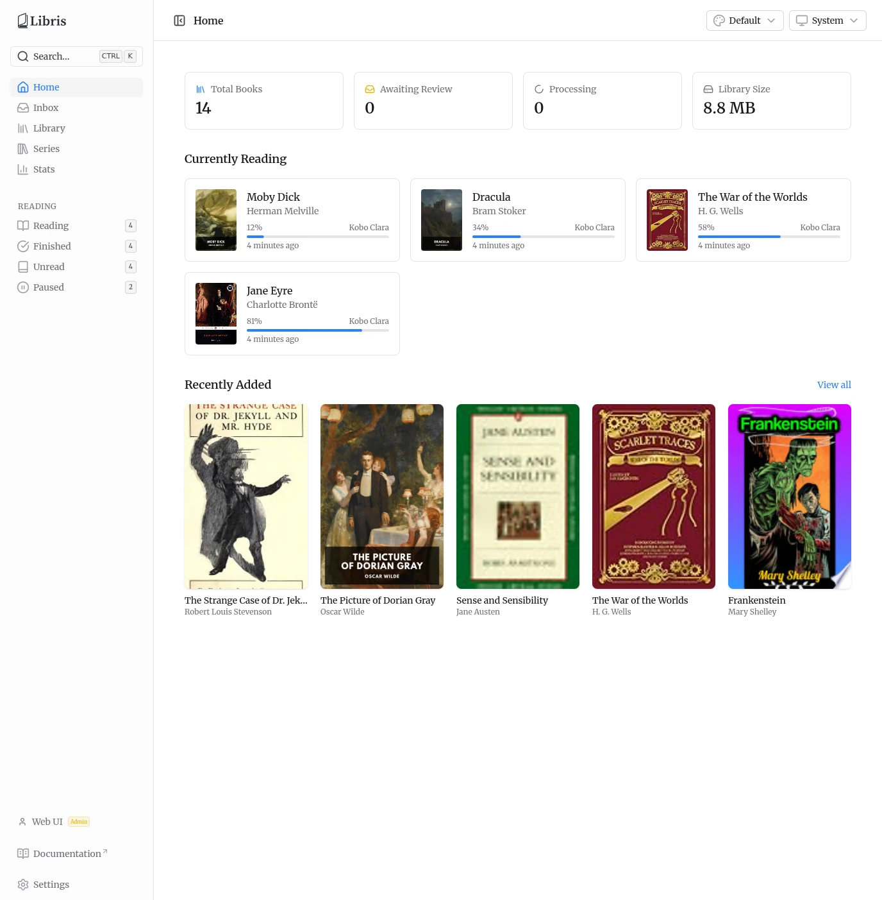

# Libris

A self-hosted book management system that ingests ebook files, enriches them with metadata from multiple sources, organizes them into a structured library, and serves them to e-readers via OPDS. Reading progress syncs with KoReader devices via KoSync.

## Features

- **Inbox workflow** — Drop ebook files into an inbox directory (or upload via web UI). The system detects new files, extracts metadata from EPUB files, and fetches enrichment data from Hardcover.
- **Metadata review** — Compare candidates from multiple sources side-by-side, pick the best fields, or enter your own. Duplicate detection flags potential matches by ISBN and fuzzy title/author similarity.
- **Library organization** — Approved books are moved to `library/Author/Title/` with downloaded cover art. Browse by grid or list view with full-text search, author/genre filters, and pagination.
- **Collections** — Create custom shelves and organize books into them.
- **OPDS catalog** — Serve your library to any OPDS-compatible e-reader (KOReader, Calibre, Moon+ Reader, etc.) with search, genre/author navigation, and direct downloads.
- **KoSync** — Sync reading progress across KoReader devices. Dashboard shows currently reading books with progress bars.
- **Reading statistics** — Track books finished, reading streaks, daily activity, and genre distribution.
- **Multi-user auth** — Email + password accounts with admin or standard roles, created by an admin (there is no self-registration). Each person mints their own app passwords for e-readers and scripts, and keeps their own reading progress, stats, and external-service connections.
- **Job monitoring** — View processing pipeline status, queue health, and retry failed jobs from the web UI.

## Screenshots

<p align="center">
  
  
</p>
<p align="center">
  
  
</p>

## Tech Stack

| Layer     | Technology                                                    |
| --------- | ------------------------------------------------------------- |
| Frontend  | Vue 3 + Vite 8 SPA, vue-router 5, Nuxt UI v4, Tailwind CSS v4 |
| Backend   | Hono, @hono/zod-openapi                                       |
| Database  | PostgreSQL 17, Drizzle ORM                                    |
| Job Queue | BullMQ, Redis 7                                               |
| Metadata  | Hardcover GraphQL API                                         |
| Testing   | Playwright (E2E), Vitest (unit)                               |
| Toolchain | Vite+ (`vp`), pnpm, Vitest, oxlint/oxfmt                      |

## Prerequisites

- Node.js 26 (see `.node-version`)
- pnpm (package manager)
- PostgreSQL 17
- Redis 7
- Docker + Docker Compose (for E2E tests)

## Getting Started

```bash
# Install dependencies
vp install

# Start the backend (port 3000)
vp run -F @libris/api-hono dev

# Start the frontend (port 3100) in another terminal
vp run -F @libris/web dev
```

Open http://localhost:3100. On a fresh install the page offers a **first-run setup form** — enter your name, email, and a password (at least 8 characters) to create the first admin account, which signs you straight in. After that it is an ordinary email + password sign-in, and further accounts are created by an admin from **Settings → Users**.

### Configuration

The API server is configured via environment variables. Copy `.env.example` to `.env` to start.

| Variable              | Required      | Purpose                                                                                                                                                                                                  |
| --------------------- | ------------- | -------------------------------------------------------------------------------------------------------------------------------------------------------------------------------------------------------- |
| `NODE_ENV`            | Yes           | `development`, `production`, or `test`. Never inferred — omitting it must not silently disable a production safeguard.                                                                                   |
| `POSTGRES_HOST`       | Yes           | Postgres host (the app assembles the URL from `POSTGRES_*` split vars)                                                                                                                                   |
| `POSTGRES_PORT`       | No            | Postgres port. Default: `5432`.                                                                                                                                                                          |
| `POSTGRES_USER`       | Yes           | Postgres user                                                                                                                                                                                            |
| `POSTGRES_PASSWORD`   | Yes           | Postgres password                                                                                                                                                                                        |
| `POSTGRES_DB`         | Yes           | Postgres database name                                                                                                                                                                                   |
| `REDIS_HOST`          | Yes           | Redis host (the app assembles the URL from `REDIS_*` split vars)                                                                                                                                         |
| `REDIS_PORT`          | No            | Redis port. Default: `6379`.                                                                                                                                                                             |
| `REDIS_PASSWORD`      | No            | Redis password                                                                                                                                                                                           |
| `REDIS_TLS`           | No            | Set to `1` for `rediss://` (TLS)                                                                                                                                                                         |
| `LIBRIS_INBOX_PATH`   | Yes           | Directory to watch for new book files                                                                                                                                                                    |
| `LIBRIS_LIBRARY_PATH` | Yes           | Directory for organized book storage                                                                                                                                                                     |
| `API_SECRET_KEY`      | Yes           | Third-party token encryption key (`openssl rand -hex 32`)                                                                                                                                                |
| `BETTER_AUTH_SECRET`  | Yes           | Signs session cookies (`openssl rand -base64 32`). No fallback — the server refuses to start without it, and published placeholders and low-diversity values are rejected.                               |
| `BETTER_AUTH_URL`     | In production | The public origin users reach, e.g. `https://libris.example.com` — scheme and host only, no path. Required when `NODE_ENV=production`; without it every browser sign-in fails with `403 INVALID_ORIGIN`. |

See [docs/environment.md](docs/environment.md) for the complete reference, including the test-environment variables, and [docs/deployment.md](docs/deployment.md) for production and upgrade instructions.

## Development

```bash
vp run check                  # Format, lint, typecheck
vp run test                   # Unit tests
vp run -F @libris/e2e e2e     # E2E tests (requires dev servers running)
vp run test:e2e:docker        # E2E tests in Docker (self-contained)
```

### Database

Migrations auto-apply when the server starts. To modify the schema:

```bash
# Edit services/api-hono/src/db/schema.ts, then:
cd services/api-hono && vp exec drizzle-kit generate   # Generate SQL migration
# Review the SQL, commit, restart server
```

## Monorepo Structure

```
apps/web/              Vue 3 + Vite 8 SPA frontend
services/api-hono/     Hono backend (API, workers, watcher, KoSync, OPDS)
  src/types/           Shared TypeScript types and Zod schemas
  src/lib/metadata/    Book metadata extraction and API clients
  src/lib/queue/       BullMQ queue constants
tests/e2e/             Playwright end-to-end tests
```

## Documentation

Detailed documentation is in the `docs/` directory:

- [Architecture](docs/architecture.md) — How the pieces connect
- [Frontend](docs/frontend.md) — Pages, auth flow, components
- [Database](docs/database.md) — Schema and migrations
- [Testing](docs/testing.md) — E2E and unit test setup
- [CI/CD](docs/ci-cd.md) — GitHub Actions pipeline
- [Deployment](docs/deployment.md) — Docker images, env vars, example compose
- [Environment Variables](docs/environment.md) — Complete reference
- [Contributing](docs/contributing.md) — Setup, workflow, code style

## License

MIT — see [LICENSE](LICENSE).
