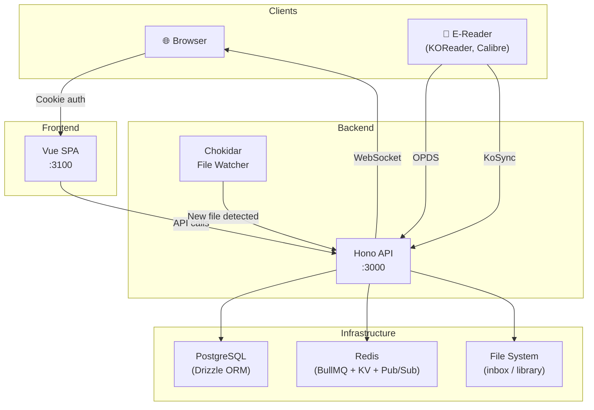
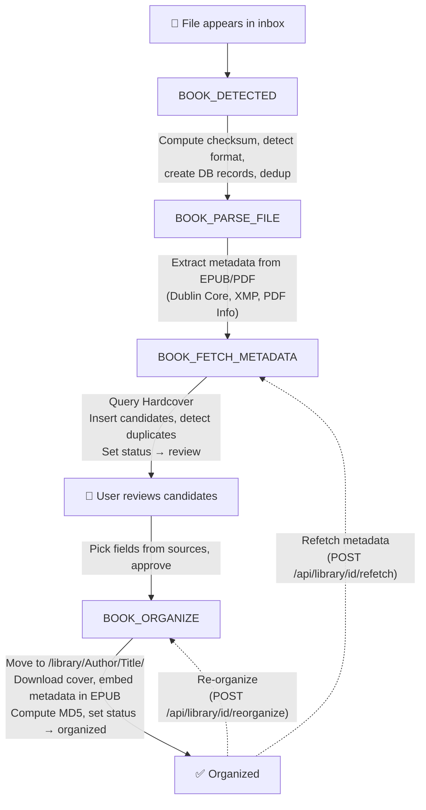

# Architecture

Libris is a self-hosted book management system. It ingests ebook files, enriches them with metadata from Hardcover, organizes them into a structured library, and serves them via OPDS for e-readers. It syncs reading progress with KoReader via KoSync.

Hardcover is currently the sole external metadata source. (The pipeline is built to accept additional sources, but none are wired up today.) A Hardcover miss still promotes the book to review using the file-derived candidate.

## Monorepo Structure

```
libris/
├── apps/web/              # Vue 3 SPA frontend, built with Vite+ (port 3100)
├── services/api-hono/     # Hono backend (port 3000)
│   ├── src/types/         # Shared TypeScript types + Zod schemas
│   ├── src/lib/metadata/  # Book metadata extraction & API clients
│   └── src/lib/queue/     # BullMQ queue constants
├── docs/                  # VitePress documentation site (@libris/docs)
├── tests/e2e/             # Playwright end-to-end tests
├── scripts/               # Build & test scripts
├── .github/workflows/     # CI/CD pipelines
└── docker-compose.test.yml
```

**Workspace management:** pnpm workspaces, orchestrated by Vite+ (the `vp` CLI built on Vite/Rolldown/Vitest/tsdown/Oxlint/Oxfmt). pnpm remains the package manager but is driven by `vp install`.

## Tech Stack

| Layer           | Technology                                                                         |
| --------------- | ---------------------------------------------------------------------------------- |
| Frontend        | Vue 3 SPA (Vite+ / Rolldown-Vite), vue-router 5, Nuxt UI v4, Tailwind CSS v4       |
| Backend         | Hono, @hono/zod-openapi                                                            |
| Database        | PostgreSQL 17, Drizzle ORM                                                         |
| Job Queue       | BullMQ, Redis 7                                                                    |
| File Watching   | Chokidar                                                                           |
| Metadata Source | Hardcover GraphQL API (requires API token via Settings) — the sole external source |
| Auth            | Better Auth 1.6 (email + password sessions, `admin` and `apiKey` plugins)          |
| Testing         | Playwright (E2E), Vitest (unit)                                                    |
| Toolchain       | Vite+ (`vp`), Vitest, Oxlint, Oxfmt, tsdown                                        |
| CI/CD           | GitHub Actions                                                                     |

## Design Decisions

### Why Hono

Hono with `@hono/zod-openapi` gives us three things in one:

1. **Typed RPC client** — Routes are defined with Zod schemas. The `hc` client (`hono/client`) infers request/response types from those schemas automatically. The frontend gets fully typed API calls with zero codegen, no hand-written interfaces, and no runtime overhead (~2KB).

2. **OpenAPI docs for free** — The same Zod schemas that power the typed client also generate the OpenAPI spec. Scalar UI at `/_docs/scalar` stays in sync with the actual code by definition.

3. **Self-contained bundle** — `tsdown` bundles the entire server into a single ~2MB file (`dist/index.mjs`). The Docker image has no `node_modules` — just the bundle and migrations.

The frontend wraps `hc` in a `useApiClient()` composable (`apps/web/src/composables/useApiClient.ts`) and loads data through Pinia Colada (`useQuery` / `useMutation`, plus `defineColadaLoader` for route-level loaders):

```ts
import { useQuery } from "@pinia/colada";

export function useLibraryQuery() {
  const client = useApiClient();
  return useQuery({
    key: ["library"],
    query: () => client.api.library.$get({ query: { page: 1 } }).then((r) => r.json()),
    // response is fully typed from the Zod schema
  });
}
```

Things that `hc` can't handle use standalone composables: `useUpload()` for XHR file uploads with progress tracking, `useServerEvents()` for realtime streaming over a WebSocket opened at `/api/events`.

### Why SPA

This is a private, self-hosted app behind authentication. Every page requires login — there are no public pages, no SEO concerns, no crawlers.

`vite build` produces pure static files in `apps/web/dist/`. In production, Hono serves these directly — no separate nginx container or Node.js runtime for the frontend. The build output is also ready for a native app shell (Capacitor/Tauri) in the future.

Auth uses httpOnly session cookies issued by Better Auth, mounted on the Hono API. Since the SPA and API are served from the same origin in production, the cookie is host-only and needs no cross-domain configuration. In production `BETTER_AUTH_URL` must name the origin the browser actually reaches, because that value — not the request socket — is what Better Auth trusts.

## How the Pieces Connect



1. **Browser** loads the Vue SPA and makes API calls directly to the Hono backend
2. **Hono API** resolves every caller through one Better Auth session lookup — browser cookie or app password alike — and manages all business logic: REST endpoints, job processing, file management
3. **Chokidar** watches the inbox directory and enqueues jobs when files appear
4. **BullMQ workers** process jobs: detect → parse → fetch metadata → organize

If parsing cannot extract any usable metadata, the pipeline stops before external lookup and the book is moved to manual review instead of issuing an ambiguous fallback search. 5. **Event bus** bridges Redis pub/sub to WebSocket clients via a local EventEmitter. The publisher reuses the shared ioredis instance; the subscriber uses a dedicated connection (required by Redis SUBSCRIBE mode). Reconnection uses exponential backoff (200ms–10s) with automatic resubscribe 6. **Redis connections** are consolidated through a single shared ioredis instance (`getSharedRedis()`). BullMQ queues, the KV store, the cache, and the event-bus publisher all share this one connection. Only BullMQ workers (which need blocking reads) and the event-bus subscriber (which needs SUBSCRIBE mode) open their own connections — ~8 total in production instead of ~20 7. **OPDS** serves the organized library to e-readers (Calibre, KOReader, etc.) 8. **KoSync** syncs reading progress between KoReader devices

## Backend: Single-Process Monolith

The API server runs everything in one Hono process. All bootstrap logic lives in a single file (`src/bootstrap.ts`) that runs each step in order:

1. **Validate directory access** — checks that `LIBRIS_INBOX_PATH` and `LIBRIS_LIBRARY_PATH` are readable/writable (skipped in test)
2. **Run migrations** — applies Drizzle migrations before accepting requests (skipped in test — tests use PGlite with manual migration)
3. **Create DB singleton** — initializes the Drizzle database connection
4. **Setup KV stores** — Redis-backed in production, in-memory in dev/test
5. **Create BullMQ queues** — reuses the shared ioredis instance (stubbed in test)
6. **Start inbox file watcher** — Chokidar watches `LIBRIS_INBOX_PATH` for new files (skipped in test)
7. **Start BullMQ workers + schedulers** — initializes workers for all pipeline and scheduled queues (skipped in test)
8. **Register shutdown handler** — graceful teardown of workers, queues, watcher, event bus, Redis, and DB

### Workers

In addition to the ingestion pipeline queues, scheduled workers handle external sync and maintenance:

| Worker                     | Schedule   | Purpose                                                                                                                                                                                                                                                                                                                  |
| -------------------------- | ---------- | ------------------------------------------------------------------------------------------------------------------------------------------------------------------------------------------------------------------------------------------------------------------------------------------------------------------------ |
| `hardcover-sync`           | Daily 4 AM | Bidirectional reading-status sync with Hardcover for all linked books (push: Libris → Hardcover; pull: Hardcover → `reading_aggregate.external_status`). Gated on `hardcover.syncEnabled` setting; ISBN matching gated on `hardcover.metadataEnabled` and on an admin having connected Hardcover, whose quota it spends. |
| `progress-history-cleanup` | Daily 3 AM | Cleans up reading progress history older than 1 year                                                                                                                                                                                                                                                                     |

### Scheduled Tasks

Scheduled maintenance runs as BullMQ scheduled jobs on the `db-maintenance` queue. A single worker handles the queue and dispatches by `job.name`:

| Job (`job.name`)         | Schedule   | Purpose                                                                                       |
| ------------------------ | ---------- | --------------------------------------------------------------------------------------------- |
| `cleanup-stale-inbox`    | Daily 3 AM | Deletes books still in `status = 'inbox'` whose `updated_at` is older than 30 days            |
| `cleanup-orphaned-files` | Daily 3 AM | Deletes `book_files` rows whose `storage_path` no longer exists on disk (orphaned DB records) |
| `cleanup-completed-jobs` | Hourly     | Prunes completed jobs older than 7 days from every queue                                      |

These schedulers are registered in `bootstrap.ts` via `maintenanceQueue.upsertJobScheduler(...)`.

#### Boot backfills

The same `db-maintenance` queue also runs four one-time backfill jobs, enqueued at boot with fixed job IDs so they execute once per version and are deduplicated on restart:

| Job (`job.name`)             | Purpose                                                                                                  |
| ---------------------------- | -------------------------------------------------------------------------------------------------------- |
| `rebuild-book-files`         | Recreates missing `book_files` rows and recomputes content hashes                                        |
| `backfill-content-hashes`    | Computes content hashes for library files that lack one                                                  |
| `backfill-reading-aggregate` | Derives `reading_aggregate` rows from `reading_progress_history` for existing finished/in-progress books |
| `link-orphan-progress`       | Links `reading_progress` rows orphaned with `book_id = NULL` to their book once it can be resolved       |

### Job & Queue Management API

The `/api/jobs` routes expose BullMQ internals for the admin UI. Queue listings
cover every queue in the registry — the ingestion pipeline queues (`book-*`),
scheduler queues (`hardcover-sync`, `progress-history-cleanup`), and the
`db-maintenance` queue. The same aggregation backs `/api/settings/status` for
the admin diagnostics panel. The home dashboard's "pipeline" indicator is
intentionally scoped to the ingestion queues only, since it reports on book
ingestion flow rather than overall queue health — and, because per-queue counts
are a property of the install rather than of a person, it is sent to admins
only. A non-admin's dashboard derives its `processingCount` from the book ids
carrying in-flight jobs, intersected with the ones they own.

| Method | Path                             | Purpose                                              |
| ------ | -------------------------------- | ---------------------------------------------------- |
| GET    | `/api/jobs`                      | List jobs across all queues (paginated, filterable)  |
| GET    | `/api/jobs/status`               | Job counts per queue (waiting/active/completed/etc.) |
| GET    | `/api/jobs/failed`               | List failed jobs across all queues                   |
| GET    | `/api/jobs/{id}`                 | Full job detail (payload, timestamps, progress)      |
| GET    | `/api/jobs/{id}/logs`            | Job log lines stored via `job.log()`                 |
| POST   | `/api/jobs/{id}/retry`           | Retry a failed job                                   |
| POST   | `/api/jobs/queues/{name}/pause`  | Pause a queue                                        |
| POST   | `/api/jobs/queues/{name}/resume` | Resume a paused queue                                |
| POST   | `/api/jobs/queues/{name}/clean`  | Remove all failed jobs from a queue                  |
| POST   | `/api/jobs/queues/{name}/drain`  | Remove all waiting/delayed jobs from a queue         |

### Reading Status

Reading status is derived from KoSync progress data rather than being set manually:

- **unread** — no progress recorded
- **reading** — progress between 0% and 95%
- **finished** — progress at or above 95% (`FINISHED_THRESHOLD = 0.95`)
- **paused** — no progress update for 30 days (`PAUSED_DAYS = 30`), or a manual override

A manual reading-status override always wins over the computed status.

## Frontend: SPA

The Vue app runs as a Single Page Application (SPA):

- The Hono API sets httpOnly auth cookies directly — no BFF proxy layer
- All API calls go directly from the browser to the Hono backend
- Authentication is handled via httpOnly cookies set by the API's `/api/auth/*` endpoints
- CORS is configured on the API to allow requests from the SPA origin

### Route Surface

Routing is file-based via `unplugin-vue-router`. The top-level pages are:

| Route                          | Page                                                                                 |
| ------------------------------ | ------------------------------------------------------------------------------------ |
| `/`                            | Dashboard (stat cards, currently reading, recently added, pipeline status)           |
| `/inbox`, `/inbox/:id`         | Inbox list and per-book metadata review                                              |
| `/library`, `/library/:id`     | Library grid/list and book detail                                                    |
| `/series`, `/series/:name`     | Series grid and per-series detail (books ordered by series position)                 |
| `/stats`                       | Reading analytics (ECharts: summary cards, yearly heatmap, six charts)               |
| `/reading`, `/reading/:status` | Reading shelves (`reading` / `finished` / `unread` / `paused`); `/reading` redirects |
| `/settings`                    | Settings (tabbed; requires a session)                                                |

There is also `/login`, which carries both sign-in and — while nobody on the install can sign in with a password yet — the first-run admin form. It is the only route reachable without a session; every other path redirects there.

Series, the Reading shelves, and Stats each have their own sidebar entry. See [docs/frontend.md](./frontend.md) for the full page list, composables, and components.

### OPDS Feed Surface

The OPDS catalog (`/opds/*`, Basic auth, realm `Libris OPDS`) serves the shared organized library to e-readers. The root navigation feed links four browse feeds plus an OpenSearch descriptor:

| Feed                      | Purpose                                                                                              |
| ------------------------- | ---------------------------------------------------------------------------------------------------- |
| `/opds`                   | Root navigation feed                                                                                 |
| `/opds/new`               | New Arrivals                                                                                         |
| `/opds/books`             | All Books (acquisition feed)                                                                         |
| `/opds/genres`            | Browse by genre                                                                                      |
| `/opds/series`            | Browse by series                                                                                     |
| `/opds/languages`         | Browse by language (rendered as full names from ISO 639-1 codes)                                     |
| `/opds/search`            | OpenSearch descriptor and query results                                                              |
| `/opds/authors/{slug}`    | Books by author — reachable only from a book entry's author link; there is no top-level authors feed |
| `/opds/covers/{id}`       | Cover image for a book                                                                               |
| `/opds/download/{fileId}` | Download a book file                                                                                 |

Only EPUB is a recognized download format (`FORMAT_MIMES` maps `epub` only). The feed is the shared catalog: every authenticated OPDS user sees all organized books. There is no OPDS-specific credential — a reader signs in with the owner's email as the Basic username and an app password as the Basic password. Only the password component is checked; the username is informational.

## Multi-User Auth

### Auth Model

Identity and credential are separate things. A **user** (`users`, plus `accounts` for the password hash) is a person; a **credential** is one of three ways that person proves who they are.

| Credential        | Stored in                        | Used by                                            |
| ----------------- | -------------------------------- | -------------------------------------------------- |
| Email + password  | `accounts` (Better Auth hashing) | The browser. Yields a session cookie.              |
| App password      | `api_keys` (SHA-256, no expiry)  | E-readers, OPDS, Bruno, curl, cron.                |
| KoSync credential | `kosync_credentials` (SHA-256)   | KOReader's progress-sync protocol, on `/kosync/*`. |

Authentication is [Better Auth](https://better-auth.com) (`services/api-hono/src/lib/auth.ts`), mounted on `/api/auth/*`, with the `admin` plugin for roles and user management and the `apiKey` plugin for app passwords. Sessions live in Redis (`secondaryStorage`) and are mirrored into the `sessions` table so the Account tab can list and revoke devices. Better Auth's signed cookie cache is deliberately off, so a revoked session, a role change or a ban takes effect on the very next request.

Self-registration is disabled outright (`emailAndPassword.disableSignUp`). Accounts are created in exactly two places:

- `POST /api/setup` — first-run bootstrap, public because nobody can authenticate yet. It is available only while **no credential exists anywhere on the install**, not merely while no user exists: on a deployment upgraded from the pre-Better-Auth schema, the cutover migration created users with no password, and this endpoint attaches the submitted email and password to one of those existing rows rather than adding a duplicate person. It returns 409 once any credential exists.
- The admin plugin's user-management endpoints, driven from **Settings → Users**.

`enableSessionForAPIKeys` makes the `apiKey` plugin resolve a valid app password into a full session, so `authMiddleware` answers for cookies and app passwords with a single `auth.api.getSession()` call. The cost is authority — a credential pasted into a KOReader config carries everything its owner can do — which is why app passwords are scoped by path (see below) rather than by per-key permissions.

#### Route policy table

Route-level policies are declared in `shared/route-policy.ts` — first match wins, and anything that matches nothing (SPA static files, favicon) is `skip`:

| Order | Pattern       | Match  | Policy     | Behaviour                                                                                               |
| ----- | ------------- | ------ | ---------- | ------------------------------------------------------------------------------------------------------- |
| 1     | `/api/auth/`  | prefix | `skip`     | Better Auth authenticates its own endpoints. A prefix, so nested plugin routes stay covered.            |
| 2     | `/api/setup`  | exact  | `public`   | No authentication. Self-guarding: 409s once any credential exists.                                      |
| 3     | `/api/health` | exact  | `optional` | Session resolved if one is presented; the response is enriched when it is.                              |
| 4     | `/kosync/`    | prefix | `kosync`   | `x-auth-user` / `x-auth-key` against `kosync_credentials`. `users/auth` and `users/create` self-handle. |
| 5     | `/opds`       | prefix | `opds`     | Same session lookup as `api-key`; a 401 also carries `WWW-Authenticate: Basic realm="Libris OPDS"`.     |
| 6     | `/__test/`    | prefix | `test`     | Constant-time compare of `x-test-token` against `TEST_ROUTE_TOKEN` (32+ chars). Never anonymous.        |
| 7     | `/_`          | prefix | `skip`     | Scalar UI and the OpenAPI JSON.                                                                         |
| 8     | `/api/jobs`   | prefix | `admin`    | Requires a session whose user has role `admin`. App passwords refused.                                  |
| 9     | `/api/`       | prefix | `api-key`  | Default for the API: requires a session, from either credential.                                        |

The policy name `api-key` is historical; it means "authenticated", not "app password only".

#### App-password scoping

A second table in the same file, `APP_PASSWORD_DENIED`, lists paths that refuse an app-password credential outright with 403, whatever role its owner holds. The refusal happens **before** the session is resolved, and the signal is the credential the caller presented (`apiKeyFromHeaders`), not anything on the resolved session.

| Prefix               | Why                                                                                                                                                                                                          |
| -------------------- | ------------------------------------------------------------------------------------------------------------------------------------------------------------------------------------------------------------ |
| `/api/auth/`         | Password and email changes, admin user management, and the plugin route that mints app passwords.                                                                                                            |
| `/api/app-passwords` | A credential must not mint or revoke credentials.                                                                                                                                                            |
| `/api/credentials`   | Sets the KoSync password and the Hardcover token — one credential rewriting another.                                                                                                                         |
| `/api/settings`      | `PATCH` calls `requireAdmin()` in its handler, and both GETs widen for admins (queue counts, failed-job arguments, filesystem paths). The table matches on path only, so this cannot move to policy `admin`. |

Policy `admin` refuses app passwords on its own, so a path already declared `admin` needs no entry here. A handler that instead calls `requireAdmin()` or branches on `isAdmin()` internally resolves to plain `api-key` and **must** be listed — `route-policy.test.ts` scans the routes directory and fails the build otherwise.

#### Bans

Banning is the admin plugin's, applied from Settings → Users, but Better Auth only checks `banned` when it _creates_ a session — which an app password never does. `shared/user-ban.ts` exports `isUserBanned`, applied in the middleware's session resolution (covering cookies and app passwords in one place) and again in `validateKosyncCredentials`. Banning additionally sets `enabled = false` on every one of that user's `api_keys` rows.

**Unbanning does not restore them.** The rows stay visible on the devices page so the user can see what was cut off, and an unban must never silently re-authorize a device that may be the reason for the ban. An unbanned user mints a fresh app password and re-pairs.

#### Revoking a live event socket

Every HTTP path re-checks the credential on each request. A WebSocket does not: `/api/events` authenticates once, at upgrade, and then stays open for as long as the tab does. Revocation therefore has to reach the socket separately, and it does so two ways at once. `lib/event-socket-registry.ts` holds every open socket, indexed by session token and user id.

**Eagerly, from database hooks.** `createAuth`'s `databaseHooks` close a socket when Better Auth deletes its `sessions` row (`session.delete`), when a user row is written with `banned` set (`user.update`), and when an account is removed (`user.delete`). These are hooks on the WRITE, not on the endpoint, which matters twice over: a dozen endpoints across the core and the `admin` plugin revoke sessions and all of them funnel through `internalAdapter.deleteSession` / `deleteUserSessions` / `updateUser` / `deleteUser`, so there is no list of endpoints to keep current — and a hook that fires on the write cannot fire for a call that was refused.

**As a backstop, on a timer.** Each open socket re-resolves its own credential every 60 seconds and closes it if the session is gone, the account is banned, the identity changed, or the role changed. This is not redundancy: it is the only thing that covers a session that merely _expired_ (nothing deletes it, so no hook fires), an app password that was disabled (those sockets have no session row to fire on), and a revocation served by a different process. A store outage is deliberately **not** treated as revocation — an unreachable Redis or Postgres leaves the socket open rather than severing every stream on the install.

**Two close codes, because the server has two things to say.** Both live in `lib/event-socket-registry.ts` and both sit in the 4000-4999 range RFC 6455 reserves for the application:

| Code                                     | Meaning                                                                 | Sent for                                                                                                    | The client must                                        |
| ---------------------------------------- | ----------------------------------------------------------------------- | ----------------------------------------------------------------------------------------------------------- | ------------------------------------------------------ |
| `4401` `EVENT_SOCKET_REVOKED_CLOSE_CODE` | The credential is gone. Terminal.                                       | `session revoked`, `account banned`, `account removed` (hooks); `session revoked`, `account banned` (timer) | stop reconnecting and sign the user out                |
| `4409` `EVENT_SOCKET_RESCOPE_CLOSE_CODE` | The credential is fine; this socket's scope is stale. **Not** terminal. | `identity changed`, `role changed` (timer only)                                                             | reconnect as after any drop; the new socket is rebound |

The split exists because a subscription's user id and admin flag are baked in at upgrade and never change, so a promotion, a demotion or a cookie that starts resolving to somebody else all have to close the socket — while the session behind it stays perfectly valid. Sent as `4401` those were indistinguishable from a ban, and the client dutifully signed the user out: being made an admin logged you out. `4409` mirrors HTTP 409 — a conflict of state, not of identity.

Closing tears the event-bus subscription down before the transport, so "closed" means "receives nothing" rather than "will stop receiving shortly" — `ws.close()` is a handshake, and the socket stays writable until the peer answers. The connection slot is returned to the per-principal cap at the same time, for both codes: a re-scoped client must be able to dial straight back in.

#### CSRF

Unsafe methods (`POST`/`PUT`/`PATCH`/`DELETE`) that carry a cookie are rejected with 403 when `Sec-Fetch-Site: cross-site` is present, or when an `Origin` header names a host other than the server's own (plus `localhost:3100`/`:3000` outside production). Headerless clients — an app password or OPDS request, which sends no cookie and no browser `Origin` — fall through untouched.

### Book Ownership

Each book tracks its uploader via `books.created_by`, a `NOT NULL` text column referencing `users.id` with `ON DELETE RESTRICT`. Upload attribution flows through the `upload_registry` table, which deduplicates by file checksum so re-uploads of the same file are ignored. Books found by the inbox watcher rather than uploaded through the API are owned by the oldest admin.

`requireBookOwnership(c, db, bookId)` enforces access control on mutations: only the uploading user or an admin can modify or delete a book. Because the column is `NOT NULL` there is no "unowned book" branch, and deleting a user who owns books is refused by the database — `reassignBooksOnRemoveUser` (`lib/user-deletion.ts`) moves them to the acting admin before Better Auth's deletion runs.

### Data Isolation

Per-user data is scoped by user id:

- **Reading progress** — `reading_progress.user_id`, unique on `(user_id, document, device)`
- **App passwords** — `api_keys.reference_id`, one row per paired device or script
- **KoSync credentials** — one row per user in `kosync_credentials`
- **Hardcover token and sync state** — `service_credentials` and `hardcover_sync_log`, per user
- **Stats and streaks** — dashboard reading stats and streak counts are computed per user
- **Pre-approval uploads** — books in `inbox` or `review` status are filtered by `books.created_by` everywhere they are counted or listed, admins excepted. That includes `GET /api/inbox`, `/api/inbox/count`, `/api/inbox/processing`, and on `GET /api/dashboard` the `inboxCount` and `stats.processingCount` fields. `stats.totalFileSize` counts only organized books' files for the same reason, and `pipeline` — install-wide queue counts, which cannot be attributed to an owner — is admin-only

Shared data (the book catalog, library organization, metadata) is visible to all authenticated users. Once a book reaches `organized` status it is shared, which is why `totalBooks`, `totalAuthors`, `topGenre`, `totalFileSize` and `recentlyAdded` are deliberately install-wide.

### Rate Limiting

Two limiters, split by prefix.

**Better Auth owns `/api/auth/*`** — sign-in, sign-out, password and email changes, the admin plugin, API-key management. It applies its own per-endpoint windows, far tighter than a shared tier can express (three requests per ten seconds on sign-in and password change), with counters in the same Redis as sessions so they survive a restart. The app's limiter skips that prefix entirely: two limiters on one route means two budgets and a 429 that neither one accounts for. Tune it in `services/api-hono/src/lib/auth.ts`, not through env vars.

**The app's limiter owns everything else**, per client IP via Redis, with an in-memory fallback for the credential tiers. Defaults are sized for LAN/VPN deployments (the typical Libris install) and are tunable via `LIBRIS_RATELIMIT_*` — see [Environment Variables](./environment.md).

The HTTP-path Redis connection is separate from BullMQ's unlimited-retry
connection. Commands reject within 250 ms so the fallback policy can run, and
counter increments are atomic under concurrency. `/api/health` bypasses the
limiter and uses the bounded connection for its Redis diagnostic.

| Tier          | Default limit | Applied to                                                                                                             |
| ------------- | ------------- | ---------------------------------------------------------------------------------------------------------------------- |
| `auth`        | 30 req/min    | `/kosync/users/auth`, plus the credential-creation routes below                                                        |
| `keyCreation` | 30 req/hour   | `POST /api/setup`, `POST /api/app-passwords` (stacks with `auth`)                                                      |
| `general`     | 600 req/min   | Every other path, including static files, unknown paths, OPDS browsing, and listing or revoking your own app passwords |

`/kosync/users/auth` is the one credential check outside Better Auth's reach: KOReader speaks its own protocol on its own prefix. The two creation routes each cost a password hash, and `POST /api/setup` is public by necessity — nobody can authenticate on a fresh install — so it gets the strictest budget in the app.

Reading and revoking your own credentials sits in `general`: those probe nothing. So does OPDS, because reader apps browse feeds in chatty bursts.

If exposing Libris publicly, lower the defaults via env vars (e.g. `LIBRIS_RATELIMIT_GENERAL_LIMIT=100`, `LIBRIS_RATELIMIT_AUTH_LIMIT=10`).

Each app-owned window starts on that client's first request, avoiding the double burst possible at global wall-clock boundaries. IP extraction reads the direct connection address by default. Forwarded headers are honored only when enabled and the immediate peer belongs to `LIBRIS_TRUSTED_PROXIES`; the chain is walked right-to-left past trusted hops. IPv6 addresses share a `/64` bucket. Credential checks also receive a hashed per-credential budget alongside their address budget, preventing source-address rotation from resetting guesses against one account. Deriving that budget means reading the username or email out of the JSON body, so the limiter caps what it will parse at 8 KB — and a credential body over that cap (`POST /api/auth/sign-in/email`, `POST /kosync/users/auth`) is answered with 413 rather than let through unbucketed. Padding the body would otherwise be a way out of the per-credential budget, and on the sign-in path there is no app-owned per-IP tier behind it to catch the overflow. No legitimate sign-in or KOReader login body comes anywhere near 8 KB. The same resolved address is injected into Better Auth and access logs, so authentication, limiting, and incident records cannot disagree. Rate limiting stays enabled in development through the in-memory store; only the explicit E2E switch disables it.

## Book Ingestion Pipeline

See the [API Reference](/api/) for endpoint details.



`BOOK_FETCH_METADATA` queries Hardcover, the sole external metadata source. A Hardcover miss is not fatal: the book is still promoted to review using the file-derived candidate. The chain ends at `status = 'review'` — `BOOK_ORGANIZE` is a manual gate and is never auto-enqueued. It runs only when a user approves the book (the approve endpoint enqueues it). EPUB is the only ingested format; other formats are silently ignored.

Queue payloads are treated as untrusted input. The detect and parse workers require absolute, existing file paths whose canonical targets remain inside `LIBRIS_INBOX_PATH`; invalid paths fail without retrying or writing database rows. Organization sanitizes metadata-derived author and title components, including dot segments and reserved filesystem names, and validates the complete destination inside `LIBRIS_LIBRARY_PATH` before creating directories. File-serving routes apply the same canonical boundary check, returning 404 for a missing file and 403 for an attempted escape.

Uploads are rejected before writing unless the content is a structurally valid EPUB ZIP whose first entry is the uncompressed `mimetype` file containing `application/epub+zip`. EPUB ZIP processing then enforces a 16 MiB uncompressed limit per entry and a 64 MiB total archive budget. DEFLATE runs asynchronously with an output ceiling, so a lying central directory cannot bypass the declared-size check or synchronously block the HTTP process. OPF documents have a tighter 2 MiB input limit and bounded, linear metadata element scanning. When approved metadata is embedded, the rebuilt EPUB preserves the original compression method for existing entries; the required first `mimetype` entry remains uncompressed.

Every organize enqueue uses a deterministic per-book job ID, collapsing concurrent duplicate requests while a job is waiting or active. User-triggered reorganization is limited to ten in-flight jobs per user. XML-invalid metadata controls are removed during ingestion and again at OPDS serialization, ensuring a dirty database row cannot make an entire Atom feed malformed. Persisted external cover values are limited to credential-free HTTP(S) URLs; DNS and address validation remains the fetcher's responsibility.

Remote cover images use one hardened fetch path for inbox previews and organized-library downloads. Each redirect is handled manually with a five-hop limit. Every hostname is resolved once, all answers are checked against parsed IPv4 and IPv6 special-use ranges, and the connection is pinned to the validated address while preserving the original Host header and TLS server name. Responses are limited to 10 MiB and accepted only when a supported image Content-Type matches the JPEG, PNG, GIF, or WebP signature.

Inbox records, counts, processing state, details, and covers are scoped to the owning user for non-admins; admins retain the instance-wide review view. API responses never expose inbox filesystem paths, and infrastructure paths are admin-only.

Uploader attribution on organized books works the other way round, because the library itself is shared: every user sees the uploader badge and can filter by it, so the facets are **not** restricted. What is withheld is identity, not attribution — `uploader.id` is an opaque per-install HMAC of the user id rather than the raw `users.id`, and `books.created_by` is nulled for callers who neither own the book nor are admins. Raw user ids are an enumeration primitive, not product data; the badge and the filter are product data. A user-triggered Hardcover sync processes only that user's reading state, while scheduled sync jobs perform the global ISBN-matching and edition-page maintenance phases on an admin's Hardcover quota (see [Hardcover Reading-Status Sync](#hardcover-reading-status-sync)).

During `BOOK_PARSE_FILE`, the book's language is predicted into a canonical ISO 639-1 code (`en`, `it`, …). The embedded `<dc:language>` tag is normalized via `normalizeLanguage` (`src/lib/languages.ts`) — mapping BCP-47 tags (`en-GB` → `en`), ISO 639-2/3 codes (`eng` → `en`), and names (`English`/`italiano` → `en`/`it`). When the tag is missing or unrecognized, the language is detected with `tinyld` (`src/lib/metadata/detect-language.ts`, length-gated, best-effort) from a sample of the book's own body prose — `extractEpubTextSample` walks the EPUB spine in reading order, skips short front-matter documents, and accumulates ~1.5 KB of clean text — falling back to the title + description if no substantial prose is found. The body is only read on this fallback path (when there's no usable tag). `normalizeLanguage` is shared with the web app via `@libris/api-hono/languages` so the edit form, review picker, and library filter all speak codes while displaying full names; the PATCH and apply-metadata routes re-normalize on write as a safety net. Existing rows can be cleaned up with the `db:normalize-languages` script (dry-run by default, `--apply` to write).

Jobs retry up to 3 times with exponential backoff (1s base), except payloads rejected as structurally unsafe, which fail without retrying. Completed jobs are automatically removed after 1,000 entries or 7 days (`removeOnComplete: { count: 1000, age: 7 * 24 * 3600 }`), and failed jobs are capped at 1,000 entries (`removeOnFail: { count: 1000 }`, no age component), preventing unbounded Redis memory growth. Each worker has a tuned `lockDuration` (30s–10min depending on expected job time). Pipeline-stage workers use `maxStalledCount: 2`; the organize, `hardcover-sync`, `progress-history-cleanup`, and `db-maintenance` workers use `maxStalledCount: 1`. Either way, hung jobs are detected and recovered by BullMQ's stalled job checker. The hardcover sync worker checkpoints progress, allowing it to resume from where it left off after a crash.

## Hardcover Reading-Status Sync

The `hardcover-sync` worker is bidirectional for status:

- **Push (Libris → Hardcover)** — for each user, find books whose computed status or progress drifted from `hardcover_sync_log.last_status/last_progress` and upsert via `insert_user_book` + `insert_user_book_read`. Books with no local reading data are not pushed (so we don't clobber Hardcover with `unread`).
- **Pull (Hardcover → Libris)** — for each user, fetch the full `me.user_books` list, map `status_id` → `ReadingStatus` (1=unread, 2=reading, 3=finished, 4=paused, 5(DNF)=paused), and upsert `reading_aggregate.external_status`. This lets a fresh Libris install instantly reflect the user's existing Hardcover library on connect.

Push and pull both run per user, on that user's own token. The scheduled run additionally performs an install-wide phase — ISBN matching and the edition page-count backfill, over the whole catalog rather than one person's shelf — and that phase **spends an admin's Hardcover API quota**: it is billed to and rate-limited against the account of the oldest admin who has connected Hardcover, chosen the same way on every run. If no admin has connected Hardcover the phase is skipped with a warning in the logs; it never falls back to another user's token, because install-wide work has no business consuming an ordinary member's third-party quota. Connect Hardcover on an admin account to enable it. (Per-book metadata enrichment is different: it has an obvious person to bill, so it prefers the book owner's own token and falls back to any token on the install.)

The effective reading status used by the API and UI follows this precedence:

```
manual_status                                        -- user override (also pushed)
?? local-computed (only if any local reading_progress for this book)
?? external_status                                   -- Hardcover-pulled fallback
?? "unread"
```

`external_status` is read-only from the push side — it never feeds back outward, which prevents a sync loop. Only `manual_status` represents authoritative user intent that flows in both directions (the outward push of `manual_status` is tracked separately, see issue libris-wfmj).
