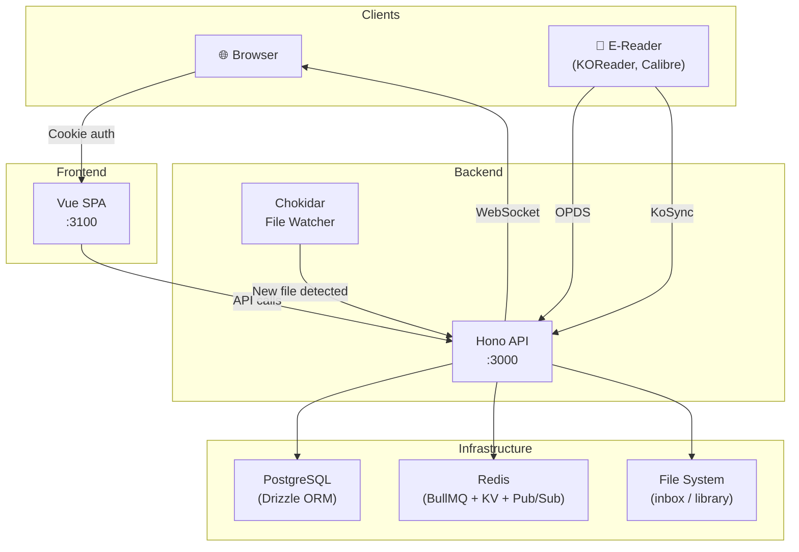
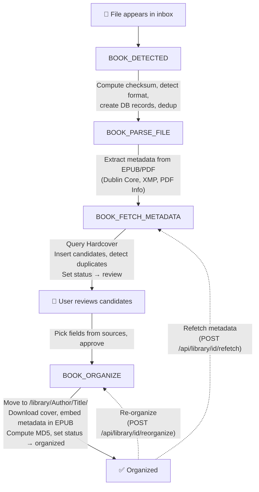

# Architecture

Libris is a self-hosted book management system. It ingests ebook files, enriches them with metadata from Hardcover, organizes them into a structured library, and serves them via OPDS for e-readers. It syncs reading progress with KoReader via KoSync.

Hardcover is currently the sole external metadata source. (The pipeline is built to accept additional sources, but none are wired up today.) A Hardcover miss still promotes the book to review using the file-derived candidate.

## Monorepo Structure

```
libris/
├── apps/web/              # Vue 3 SPA frontend, built with Vite+ (port 3100)
├── services/api-hono/     # Hono backend (port 3000)
│   ├── src/types/         # Shared TypeScript types + Zod schemas
│   ├── src/lib/metadata/  # Book metadata extraction & API clients
│   └── src/lib/queue/     # BullMQ queue constants
├── docs/                  # VitePress documentation site (@libris/docs)
├── tests/e2e/             # Playwright end-to-end tests
├── scripts/               # Build & test scripts
├── .github/workflows/     # CI/CD pipelines
└── docker-compose.test.yml
```

**Workspace management:** pnpm workspaces, orchestrated by Vite+ (the `vp` CLI built on Vite/Rolldown/Vitest/tsdown/Oxlint/Oxfmt). pnpm remains the package manager but is driven by `vp install`.

## Tech Stack

| Layer           | Technology                                                                         |
| --------------- | ---------------------------------------------------------------------------------- |
| Frontend        | Vue 3 SPA (Vite+ / Rolldown-Vite), vue-router 5, Nuxt UI v4, Tailwind CSS v4       |
| Backend         | Hono, @hono/zod-openapi                                                            |
| Database        | PostgreSQL 17, Drizzle ORM                                                         |
| Job Queue       | BullMQ, Redis 7                                                                    |
| File Watching   | Chokidar                                                                           |
| Metadata Source | Hardcover GraphQL API (requires API token via Settings) — the sole external source |
| Auth            | bcrypt-hashed API keys, httpOnly session cookies                                   |
| Testing         | Playwright (E2E), Vitest (unit)                                                    |
| Toolchain       | Vite+ (`vp`), Vitest, Oxlint, Oxfmt, tsdown                                        |
| CI/CD           | GitHub Actions                                                                     |

## Design Decisions

### Why Hono

Hono with `@hono/zod-openapi` gives us three things in one:

1. **Typed RPC client** — Routes are defined with Zod schemas. The `hc` client (`hono/client`) infers request/response types from those schemas automatically. The frontend gets fully typed API calls with zero codegen, no hand-written interfaces, and no runtime overhead (~2KB).

2. **OpenAPI docs for free** — The same Zod schemas that power the typed client also generate the OpenAPI spec. Scalar UI at `/_docs/scalar` stays in sync with the actual code by definition.

3. **Self-contained bundle** — `tsdown` bundles the entire server into a single ~2MB file (`dist/index.mjs`). The Docker image has no `node_modules` — just the bundle and migrations.

The frontend wraps `hc` in a `useApiClient()` composable (`apps/web/src/composables/useApiClient.ts`) and loads data through Pinia Colada (`useQuery` / `useMutation`, plus `defineColadaLoader` for route-level loaders):

```ts
import { useQuery } from "@pinia/colada";

export function useLibraryQuery() {
  const client = useApiClient();
  return useQuery({
    key: ["library"],
    query: () => client.api.library.$get({ query: { page: 1 } }).then((r) => r.json()),
    // response is fully typed from the Zod schema
  });
}
```

Things that `hc` can't handle use standalone composables: `useUpload()` for XHR file uploads with progress tracking, `useServerEvents()` for realtime streaming over a WebSocket opened at `/api/events`.

### Why SPA

This is a private, self-hosted app behind authentication. Every page requires login — there are no public pages, no SEO concerns, no crawlers.

`vite build` produces pure static files in `apps/web/dist/`. In production, Hono serves these directly — no separate nginx container or Node.js runtime for the frontend. The build output is also ready for a native app shell (Capacitor/Tauri) in the future.

Auth uses httpOnly cookies set by the Hono API directly. Since the SPA and API are served from the same origin, cookies work without any cross-domain configuration.

## How the Pieces Connect



1. **Browser** loads the Vue SPA and makes API calls directly to the Hono backend
2. **Hono API** handles auth via httpOnly cookies or API keys and manages all business logic: REST endpoints, job processing, file management
3. **Chokidar** watches the inbox directory and enqueues jobs when files appear
4. **BullMQ workers** process jobs: detect → parse → fetch metadata → organize

If parsing cannot extract any usable metadata, the pipeline stops before external lookup and the book is moved to manual review instead of issuing an ambiguous fallback search. 5. **Event bus** bridges Redis pub/sub to WebSocket clients via a local EventEmitter. The publisher reuses the shared ioredis instance; the subscriber uses a dedicated connection (required by Redis SUBSCRIBE mode). Reconnection uses exponential backoff (200ms–10s) with automatic resubscribe 6. **Redis connections** are consolidated through a single shared ioredis instance (`getSharedRedis()`). BullMQ queues, the KV store, the cache, and the event-bus publisher all share this one connection. Only BullMQ workers (which need blocking reads) and the event-bus subscriber (which needs SUBSCRIBE mode) open their own connections — ~8 total in production instead of ~20 7. **OPDS** serves the organized library to e-readers (Calibre, KOReader, etc.) 8. **KoSync** syncs reading progress between KoReader devices

## Backend: Single-Process Monolith

The API server runs everything in one Hono process. All bootstrap logic lives in a single file (`src/bootstrap.ts`) that runs each step in order:

1. **Validate directory access** — checks that `LIBRIS_INBOX_PATH` and `LIBRIS_LIBRARY_PATH` are readable/writable (skipped in test)
2. **Run migrations** — applies Drizzle migrations before accepting requests (skipped in test — tests use PGlite with manual migration)
3. **Create DB singleton** — initializes the Drizzle database connection
4. **Setup KV stores** — Redis-backed in production, in-memory in dev/test
5. **Create BullMQ queues** — reuses the shared ioredis instance (stubbed in test)
6. **Start inbox file watcher** — Chokidar watches `LIBRIS_INBOX_PATH` for new files (skipped in test)
7. **Start BullMQ workers + schedulers** — initializes workers for all pipeline and scheduled queues (skipped in test)
8. **Register shutdown handler** — graceful teardown of workers, queues, watcher, event bus, Redis, and DB

### Workers

In addition to the ingestion pipeline queues, scheduled workers handle external sync and maintenance:

| Worker                     | Schedule   | Purpose                                                                                                                                                                                                                                                |
| -------------------------- | ---------- | ------------------------------------------------------------------------------------------------------------------------------------------------------------------------------------------------------------------------------------------------------ |
| `hardcover-sync`           | Daily 4 AM | Bidirectional reading-status sync with Hardcover for all linked books (push: Libris → Hardcover; pull: Hardcover → `reading_aggregate.external_status`). Gated on `hardcover.syncEnabled` setting; ISBN matching gated on `hardcover.metadataEnabled`. |
| `progress-history-cleanup` | Daily 3 AM | Cleans up reading progress history older than 1 year                                                                                                                                                                                                   |

### Scheduled Tasks

Scheduled maintenance runs as BullMQ scheduled jobs on the `db-maintenance` queue. A single worker handles the queue and dispatches by `job.name`:

| Job (`job.name`)         | Schedule   | Purpose                                                                                       |
| ------------------------ | ---------- | --------------------------------------------------------------------------------------------- |
| `cleanup-stale-inbox`    | Daily 3 AM | Deletes books still in `status = 'inbox'` whose `updated_at` is older than 30 days            |
| `cleanup-orphaned-files` | Daily 3 AM | Deletes `book_files` rows whose `storage_path` no longer exists on disk (orphaned DB records) |
| `cleanup-completed-jobs` | Hourly     | Prunes completed jobs older than 7 days from every queue                                      |

These schedulers are registered in `bootstrap.ts` via `maintenanceQueue.upsertJobScheduler(...)`.

#### Boot backfills

The same `db-maintenance` queue also runs four one-time backfill jobs, enqueued at boot with fixed job IDs so they execute once per version and are deduplicated on restart:

| Job (`job.name`)             | Purpose                                                                                                  |
| ---------------------------- | -------------------------------------------------------------------------------------------------------- |
| `rebuild-book-files`         | Recreates missing `book_files` rows and recomputes content hashes                                        |
| `backfill-content-hashes`    | Computes content hashes for library files that lack one                                                  |
| `backfill-reading-aggregate` | Derives `reading_aggregate` rows from `reading_progress_history` for existing finished/in-progress books |
| `link-orphan-progress`       | Links `reading_progress` rows orphaned with `book_id = NULL` to their book once it can be resolved       |

### Job & Queue Management API

The `/api/jobs` routes expose BullMQ internals for the admin UI. Queue listings
cover every queue in the registry — the ingestion pipeline queues (`book-*`),
scheduler queues (`hardcover-sync`, `progress-history-cleanup`), and the
`db-maintenance` queue. The same aggregation backs `/api/settings/status` for
the admin diagnostics panel. The home dashboard's "pipeline" indicator is
intentionally scoped to the ingestion queues only, since it reports on book
ingestion flow rather than overall queue health.

| Method | Path                             | Purpose                                              |
| ------ | -------------------------------- | ---------------------------------------------------- |
| GET    | `/api/jobs`                      | List jobs across all queues (paginated, filterable)  |
| GET    | `/api/jobs/status`               | Job counts per queue (waiting/active/completed/etc.) |
| GET    | `/api/jobs/failed`               | List failed jobs across all queues                   |
| GET    | `/api/jobs/{id}`                 | Full job detail (payload, timestamps, progress)      |
| GET    | `/api/jobs/{id}/logs`            | Job log lines stored via `job.log()`                 |
| POST   | `/api/jobs/{id}/retry`           | Retry a failed job                                   |
| POST   | `/api/jobs/queues/{name}/pause`  | Pause a queue                                        |
| POST   | `/api/jobs/queues/{name}/resume` | Resume a paused queue                                |
| POST   | `/api/jobs/queues/{name}/clean`  | Remove all failed jobs from a queue                  |
| POST   | `/api/jobs/queues/{name}/drain`  | Remove all waiting/delayed jobs from a queue         |

### Reading Status

Reading status is derived from KoSync progress data rather than being set manually:

- **unread** — no progress recorded
- **reading** — progress between 0% and 95%
- **finished** — progress at or above 95% (`FINISHED_THRESHOLD = 0.95`)
- **paused** — no progress update for 30 days (`PAUSED_DAYS = 30`), or a manual override

A manual reading-status override always wins over the computed status.

## Frontend: SPA

The Vue app runs as a Single Page Application (SPA):

- The Hono API sets httpOnly auth cookies directly — no BFF proxy layer
- All API calls go directly from the browser to the Hono backend
- Authentication is handled via httpOnly cookies set by the API's `/api/auth/*` endpoints
- CORS is configured on the API to allow requests from the SPA origin

### Route Surface

Routing is file-based via `unplugin-vue-router`. The top-level pages are:

| Route                          | Page                                                                                 |
| ------------------------------ | ------------------------------------------------------------------------------------ |
| `/`                            | Dashboard (stat cards, currently reading, recently added, pipeline status)           |
| `/inbox`, `/inbox/:id`         | Inbox list and per-book metadata review                                              |
| `/library`, `/library/:id`     | Library grid/list and book detail                                                    |
| `/series`, `/series/:name`     | Series grid and per-series detail (books ordered by series position)                 |
| `/stats`                       | Reading analytics (ECharts: summary cards, yearly heatmap, six charts)               |
| `/reading`, `/reading/:status` | Reading shelves (`reading` / `finished` / `unread` / `paused`); `/reading` redirects |
| `/settings`                    | Settings (also the logged-out setup + login route)                                   |

Series, the Reading shelves, and Stats each have their own sidebar entry. See [docs/frontend.md](./frontend.md) for the full page list, composables, and components.

### OPDS Feed Surface

The OPDS catalog (`/opds/*`, Basic auth, realm `libris-opds`) serves the shared organized library to e-readers. The root navigation feed links four browse feeds plus an OpenSearch descriptor:

| Feed                      | Purpose                                                                                              |
| ------------------------- | ---------------------------------------------------------------------------------------------------- |
| `/opds`                   | Root navigation feed                                                                                 |
| `/opds/new`               | New Arrivals                                                                                         |
| `/opds/books`             | All Books (acquisition feed)                                                                         |
| `/opds/genres`            | Browse by genre                                                                                      |
| `/opds/series`            | Browse by series                                                                                     |
| `/opds/languages`         | Browse by language (rendered as full names from ISO 639-1 codes)                                     |
| `/opds/search`            | OpenSearch descriptor and query results                                                              |
| `/opds/authors/{slug}`    | Books by author — reachable only from a book entry's author link; there is no top-level authors feed |
| `/opds/covers/{id}`       | Cover image for a book                                                                               |
| `/opds/download/{fileId}` | Download a book file                                                                                 |

Only EPUB is a recognized download format (`FORMAT_MIMES` maps `epub` only). The feed is the shared catalog: every authenticated OPDS user sees all organized books, though OPDS credentials are per user.

## Multi-User Auth

### Auth Model

Authentication is API key-based. During initial setup (`POST /api/auth/setup`), the first key is created and marked as admin. Admin users can create additional keys via `POST /api/auth/keys`. Keys are 32-byte random hex strings, bcrypt-hashed at rest.

Clients authenticate via `Authorization: Bearer <key>` header or httpOnly session cookie (set at login). Route-level auth policies are declared in a lookup table (`route-policy.ts`) — first match wins:

| Policy     | Applied to                                 | Behavior                                         |
| ---------- | ------------------------------------------ | ------------------------------------------------ |
| `public`   | `/api/auth/setup`, `/api/auth/login`, etc. | No authentication                                |
| `optional` | `/api/health`                              | Enriched response when authenticated             |
| `api-key`  | `/api/*` (default)                         | Requires valid API key                           |
| `admin`    | `/api/jobs/*`                              | Requires valid API key with `isAdmin` flag       |
| `opds`     | `/opds/*`                                  | Basic auth against per-user service credentials  |
| `kosync`   | `/kosync/*`                                | Header-based auth (`x-auth-user` / `x-auth-key`) |

### Book Ownership

Each book tracks its uploader via `books.created_by` (foreign key to `api_keys.id`). Upload attribution flows through the `upload_registry` table, which deduplicates by file checksum so re-uploads of the same file are ignored.

`requireBookOwnership(c, db, bookId)` enforces access control on mutations: only the uploading user or an admin can modify or delete a book. Unowned books (legacy data with `created_by = null`) are admin-only.

### Data Isolation

Per-user data is scoped by API key ID:

- **Reading progress** — KoSync progress records are tied to the authenticated key
- **Service credentials** — OPDS and KoSync credentials in `service_credentials` are linked to an `api_key_id`
- **Stats and streaks** — Dashboard data (reading stats, streak counts) are computed per user
- **Hardcover sync** — External service credentials and sync state are per user

Shared data (the book catalog, library organization, metadata) is visible to all authenticated users.

### Auth Caching

The auth middleware uses in-memory `TtlCache` instances (5-minute TTL, max 500 entries) to avoid running bcrypt on every request:

- **`apiKeyCache`** — caches Bearer/session key verification results (keyed by SHA-256 of the raw key)
- **`opdsCache`** — caches OPDS Basic auth verification results

Any operation that changes key validity or privileges (deletion, role changes, credential rotation) must call `clearAuthCaches()` to prevent stale authorization data.

### Rate Limiting

Two limiters, split by prefix.

**Better Auth owns `/api/auth/*`** — sign-in, sign-out, password and email changes, the admin plugin, API-key management. It applies its own per-endpoint windows, far tighter than a shared tier can express (three requests per ten seconds on sign-in and password change), with counters in the same Redis as sessions so they survive a restart. The app's limiter skips that prefix entirely: two limiters on one route means two budgets and a 429 that neither one accounts for. Tune it in `services/api-hono/src/lib/auth.ts`, not through env vars.

**The app's limiter owns everything else**, per client IP via Redis, with an in-memory fallback for the credential tiers. Defaults are sized for LAN/VPN deployments (the typical Libris install) and are tunable via `LIBRIS_RATELIMIT_*` — see [Environment Variables](./environment.md).

The HTTP-path Redis connection is separate from BullMQ's unlimited-retry
connection. Commands reject within 250 ms so the fallback policy can run, and
counter increments are atomic under concurrency. `/api/health` bypasses the
limiter and uses the bounded connection for its Redis diagnostic.

| Tier          | Default limit | Applied to                                                                                                                         |
| ------------- | ------------- | ---------------------------------------------------------------------------------------------------------------------------------- |
| `auth`        | 30 req/min    | `/kosync/users/auth`, plus the credential-creation routes below                                                                    |
| `keyCreation` | 30 req/hour   | `POST /api/setup`, `POST /api/app-passwords` (stacks with `auth`)                                                                  |
| `general`     | 600 req/min   | Everything else under `/api/*`, `/kosync/*` and `/opds/*` — including OPDS browsing and listing or revoking your own app passwords |

`/kosync/users/auth` is the one credential check outside Better Auth's reach: KOReader speaks its own protocol on its own prefix. The two creation routes each cost a password hash, and `POST /api/setup` is public by necessity — nobody can authenticate on a fresh install — so it gets the strictest budget in the app.

Reading and revoking your own credentials sits in `general`: those probe nothing. So does OPDS, because reader apps browse feeds in chatty bursts.

If exposing Libris publicly, lower the defaults via env vars (e.g. `LIBRIS_RATELIMIT_GENERAL_LIMIT=100`, `LIBRIS_RATELIMIT_AUTH_LIMIT=10`).

IP extraction (`getRequestIp`) reads the direct connection address by default. When `TRUST_PROXY_HEADERS=1` is set, it prefers `X-Real-IP` or the first entry in `X-Forwarded-For` — use this when running behind a reverse proxy. Rate limiting is disabled in development and test environments.

## Book Ingestion Pipeline

See the [API Reference](/api/) for endpoint details.



`BOOK_FETCH_METADATA` queries Hardcover, the sole external metadata source. A Hardcover miss is not fatal: the book is still promoted to review using the file-derived candidate. The chain ends at `status = 'review'` — `BOOK_ORGANIZE` is a manual gate and is never auto-enqueued. It runs only when a user approves the book (the approve endpoint enqueues it). EPUB is the only ingested format; other formats are silently ignored.

Queue payloads are treated as untrusted input. The detect and parse workers require absolute, existing file paths whose canonical targets remain inside `LIBRIS_INBOX_PATH`; invalid paths fail without retrying or writing database rows. Organization sanitizes metadata-derived author and title components, including dot segments and reserved filesystem names, and validates the complete destination inside `LIBRIS_LIBRARY_PATH` before creating directories. File-serving routes apply the same canonical boundary check, returning 404 for a missing file and 403 for an attempted escape.

EPUB ZIP processing enforces a 16 MiB uncompressed limit per entry and a 64 MiB total archive budget. DEFLATE runs asynchronously with an output ceiling, so a lying central directory cannot bypass the declared-size check or synchronously block the HTTP process. OPF documents have a tighter 2 MiB input limit and bounded, linear metadata element scanning. When approved metadata is embedded, the rebuilt EPUB preserves the original compression method for existing entries; the required first `mimetype` entry remains uncompressed.

Remote cover images use one hardened fetch path for inbox previews and organized-library downloads. Each redirect is handled manually with a five-hop limit. Every hostname is resolved once, all answers are checked against parsed IPv4 and IPv6 special-use ranges, and the connection is pinned to the validated address while preserving the original Host header and TLS server name. Responses are limited to 10 MiB and accepted only when a supported image Content-Type matches the JPEG, PNG, GIF, or WebP signature.

During `BOOK_PARSE_FILE`, the book's language is predicted into a canonical ISO 639-1 code (`en`, `it`, …). The embedded `<dc:language>` tag is normalized via `normalizeLanguage` (`src/lib/languages.ts`) — mapping BCP-47 tags (`en-GB` → `en`), ISO 639-2/3 codes (`eng` → `en`), and names (`English`/`italiano` → `en`/`it`). When the tag is missing or unrecognized, the language is detected with `tinyld` (`src/lib/metadata/detect-language.ts`, length-gated, best-effort) from a sample of the book's own body prose — `extractEpubTextSample` walks the EPUB spine in reading order, skips short front-matter documents, and accumulates ~1.5 KB of clean text — falling back to the title + description if no substantial prose is found. The body is only read on this fallback path (when there's no usable tag). `normalizeLanguage` is shared with the web app via `@libris/api-hono/languages` so the edit form, review picker, and library filter all speak codes while displaying full names; the PATCH and apply-metadata routes re-normalize on write as a safety net. Existing rows can be cleaned up with the `db:normalize-languages` script (dry-run by default, `--apply` to write).

Jobs retry up to 3 times with exponential backoff (1s base), except payloads rejected as structurally unsafe, which fail without retrying. Completed jobs are automatically removed after 1,000 entries or 7 days (`removeOnComplete: { count: 1000, age: 7 * 24 * 3600 }`), and failed jobs are capped at 1,000 entries (`removeOnFail: { count: 1000 }`, no age component), preventing unbounded Redis memory growth. Each worker has a tuned `lockDuration` (30s–10min depending on expected job time). Pipeline-stage workers use `maxStalledCount: 2`; the organize, `hardcover-sync`, `progress-history-cleanup`, and `db-maintenance` workers use `maxStalledCount: 1`. Either way, hung jobs are detected and recovered by BullMQ's stalled job checker. The hardcover sync worker checkpoints progress, allowing it to resume from where it left off after a crash.

## Hardcover Reading-Status Sync

The `hardcover-sync` worker is bidirectional for status:

- **Push (Libris → Hardcover)** — for each user, find books whose computed status or progress drifted from `hardcover_sync_log.last_status/last_progress` and upsert via `insert_user_book` + `insert_user_book_read`. Books with no local reading data are not pushed (so we don't clobber Hardcover with `unread`).
- **Pull (Hardcover → Libris)** — for each user, fetch the full `me.user_books` list, map `status_id` → `ReadingStatus` (1=unread, 2=reading, 3=finished, 4=paused, 5(DNF)=paused), and upsert `reading_aggregate.external_status`. This lets a fresh Libris install instantly reflect the user's existing Hardcover library on connect.

The effective reading status used by the API and UI follows this precedence:

```
manual_status                                        -- user override (also pushed)
?? local-computed (only if any local reading_progress for this book)
?? external_status                                   -- Hardcover-pulled fallback
?? "unread"
```

`external_status` is read-only from the push side — it never feeds back outward, which prevents a sync loop. Only `manual_status` represents authoritative user intent that flows in both directions (the outward push of `manual_status` is tracked separately, see issue libris-wfmj).
