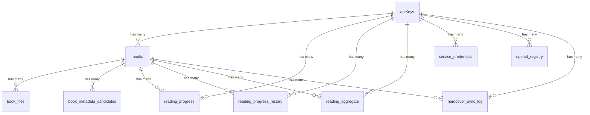

# Database Schema

> **Auto-generated** from `services/api-hono/src/db/schema.ts`. Do not edit manually.
> Run `vp run -F @libris/docs generate:db -- --db` to regenerate.

PostgreSQL with [Drizzle ORM](https://orm.drizzle.team/). Migrations auto-apply on startup via `runMigrations()` in `services/api-hono/src/bootstrap.ts` (the drizzle-orm/postgres-js migrator in `src/db/migrate.ts`); they run before the database pool is created and are skipped when `NODE_ENV=test`.

## Enums

### `book_status`

Values: `inbox`, `review`, `organized`

### `reading_status`

Values: `unread`, `reading`, `finished`, `paused`

## Tables

| Table | Description |
| ----- | ----------- |
| `api_keys` | API key records — the identity table (hashed key, label, is_admin, timestamps) |
| `books` | Main book records with status, metadata, and the full-text search vector |
| `book_files` | Physical file storage per book (format, checksums, content hashes, paths) |
| `book_metadata_candidates` | Metadata candidates per book and source (file, hardcover) shown during review |
| `reading_progress` | Current KoReader/KoSync reading position per document and device |
| `reading_progress_history` | Append-only history of reading-progress snapshots |
| `reading_aggregate` | Per-(user, book) reading lifecycle: effective status plus started/finished/paused dates and any manual override |
| `service_credentials` | Per-user credentials for OPDS, KoSync, and Hardcover (bcrypt or sealed token) |
| `app_settings` | Global key/value application settings (e.g. Hardcover metadata/sync toggles) |
| `upload_registry` | Checksum → uploader (api_key) ownership mapping consumed by the book-detected worker |
| `hardcover_sync_log` | Per-(user, book) Hardcover sync tracking and last status |

### `api_keys`

| Column | Type | Nullable | Default | Notes |
| ------ | ---- | -------- | ------- | ----- |
| `id` | uuid | No | random() | PK |
| `key_prefix` | text | No | — |  |
| `key_hash` | text | No | — |  |
| `label` | text | No | — |  |
| `is_admin` | boolean | No | false |  |
| `created_at` | timestamptz | No | now() |  |
| `last_used_at` | timestamptz | Yes | — |  |

**Indexes:** `api_keys_key_prefix_idx`

### `books`

| Column | Type | Nullable | Default | Notes |
| ------ | ---- | -------- | ------- | ----- |
| `id` | uuid | No | random() | PK |
| `status` | enum(book_status) | No | inbox |  |
| `title` | text | Yes | — |  |
| `author` | text | Yes | — |  |
| `isbn_10` | text | Yes | — |  |
| `isbn_13` | text | Yes | — |  |
| `publisher` | text | Yes | — |  |
| `published_year` | integer | Yes | — |  |
| `language` | text | Yes | — |  |
| `description` | text | Yes | — |  |
| `cover_url` | text | Yes | — |  |
| `cover_path` | text | Yes | — |  |
| `page_count` | integer | Yes | — |  |
| `series` | text | Yes | — |  |
| `series_index` | real | Yes | — |  |
| `genres` | text[] | No | [] |  |
| `tags` | text[] | No | [] |  |
| `hardcover_book_id` | integer | Yes | — |  |
| `hardcover_edition_id` | integer | Yes | — |  |
| `created_by` | uuid | Yes | — | FK → `apiKeys.id` (ON DELETE set null) |
| `possible_duplicate_of` | uuid | Yes | — |  |
| `approved_at` | timestamptz | Yes | — |  |
| `created_at` | timestamptz | No | now() |  |
| `updated_at` | timestamptz | No | now() |  |
| `search_vector` | tsvector | Yes | — |  |

**Indexes:** `books_status_created_at_idx`, `books_isbn13_idx`, `books_search_vector_idx` (GIN), `books_title_trgm_idx` (GIN), `books_author_trgm_idx` (GIN), `books_series_idx`, `books_possible_duplicate_of_idx`, `books_created_by_idx`, `books_hardcover_book_id_idx`, `books_series_series_index_uniq` (unique)

### `book_files`

| Column | Type | Nullable | Default | Notes |
| ------ | ---- | -------- | ------- | ----- |
| `id` | uuid | No | random() | PK |
| `book_id` | uuid | No | — | FK → `books.id` (ON DELETE cascade) |
| `format` | text | No | — |  |
| `original_name` | text | No | — |  |
| `storage_path` | text | Yes | — |  |
| `inbox_path` | text | Yes | — |  |
| `file_size` | bigint | No | 0 |  |
| `checksum` | text | Yes | — |  |
| `content_hash` | text | Yes | — |  |
| `original_content_hash` | text | Yes | — |  |
| `created_at` | timestamptz | No | now() |  |
| `updated_at` | timestamptz | No | now() |  |

**Indexes:** `book_files_book_id_idx`, `book_files_checksum_idx`, `book_files_content_hash_idx`, `book_files_original_content_hash_idx`

### `book_metadata_candidates`

| Column | Type | Nullable | Default | Notes |
| ------ | ---- | -------- | ------- | ----- |
| `id` | uuid | No | random() | PK |
| `book_id` | uuid | No | — | FK → `books.id` (ON DELETE cascade) |
| `source` | text | No | — |  |
| `raw_response` | jsonb | Yes | — |  |
| `normalized` | jsonb | No | {} |  |
| `confidence` | numeric(5,4) | No | 0 |  |
| `selected_fields` | text[] | No | [] |  |

**Indexes:** `book_metadata_candidates_book_id_idx`

### `reading_progress`

| Column | Type | Nullable | Default | Notes |
| ------ | ---- | -------- | ------- | ----- |
| `id` | uuid | No | random() | PK |
| `book_id` | uuid | Yes | — | FK → `books.id` (ON DELETE set null) |
| `api_key_id` | uuid | No | — | FK → `apiKeys.id` (ON DELETE cascade) |
| `document` | text | No | — |  |
| `device` | text | No | — |  |
| `device_id` | text | Yes | — |  |
| `progress` | text | No | — |  |
| `percentage` | numeric(5,4) | No | 0 |  |
| `timestamp` | bigint | No | 0 |  |
| `raw_payload` | jsonb | Yes | — |  |
| `updated_at` | timestamptz | No | now() |  |

**Indexes:** `reading_progress_device_idx`, `reading_progress_book_id_idx`, `reading_progress_api_key_id_idx`

### `reading_progress_history`

| Column | Type | Nullable | Default | Notes |
| ------ | ---- | -------- | ------- | ----- |
| `id` | uuid | No | random() | PK |
| `book_id` | uuid | Yes | — | FK → `books.id` (ON DELETE set null) |
| `api_key_id` | uuid | Yes | — | FK → `apiKeys.id` (ON DELETE set null) |
| `document` | text | No | — |  |
| `device` | text | No | — |  |
| `progress` | text | No | — |  |
| `percentage` | numeric(5,4) | No | 0 |  |
| `timestamp` | bigint | No | 0 |  |
| `created_at` | timestamptz | No | now() |  |

**Indexes:** `reading_progress_history_document_created_at_idx`, `reading_progress_history_created_at_idx`, `reading_progress_history_book_id_idx`, `reading_progress_history_api_key_id_idx`

### `reading_aggregate`

| Column | Type | Nullable | Default | Notes |
| ------ | ---- | -------- | ------- | ----- |
| `id` | uuid | No | random() | PK |
| `api_key_id` | uuid | No | — | FK → `apiKeys.id` (ON DELETE cascade) |
| `book_id` | uuid | Yes | — | FK → `books.id` (ON DELETE set null) |
| `started_at` | timestamptz | Yes | — |  |
| `finished_at` | timestamptz | Yes | — |  |
| `manual_status` | enum(reading_status) | Yes | — |  |
| `manual_started_at` | timestamptz | Yes | — |  |
| `manual_finished_at` | timestamptz | Yes | — |  |
| `manual_paused_at` | timestamptz | Yes | — |  |
| `manual_set_at` | timestamptz | Yes | — |  |
| `external_status` | enum(reading_status) | Yes | — |  |
| `external_status_synced_at` | timestamptz | Yes | — |  |
| `updated_at` | timestamptz | No | now() |  |

**Indexes:** `reading_aggregate_book_id_idx`, `reading_aggregate_api_key_id_idx`

### `service_credentials`

| Column | Type | Nullable | Default | Notes |
| ------ | ---- | -------- | ------- | ----- |
| `id` | uuid | No | random() | PK |
| `service` | text | No | — |  |
| `api_key_id` | uuid | No | — | FK → `apiKeys.id` (ON DELETE cascade) |
| `username` | text | No | — |  |
| `password_hash` | text | No | — |  |
| `created_at` | timestamptz | No | now() |  |
| `updated_at` | timestamptz | No | now() |  |

**Indexes:** `service_credentials_api_key_id_idx`, `service_credentials_service_username_uniq` (unique)

### `app_settings`

| Column | Type | Nullable | Default | Notes |
| ------ | ---- | -------- | ------- | ----- |
| `key` | text | No | — | PK |
| `value` | jsonb | No | — |  |
| `updated_at` | timestamptz | No | now() |  |

### `upload_registry`

| Column | Type | Nullable | Default | Notes |
| ------ | ---- | -------- | ------- | ----- |
| `id` | uuid | No | random() | PK |
| `checksum` | text | No | — |  |
| `api_key_id` | uuid | No | — | FK → `apiKeys.id` (ON DELETE cascade) |
| `filename` | text | No | — |  |
| `created_at` | timestamptz | No | now() |  |

### `hardcover_sync_log`

| Column | Type | Nullable | Default | Notes |
| ------ | ---- | -------- | ------- | ----- |
| `id` | uuid | No | random() | PK |
| `book_id` | uuid | No | — | FK → `books.id` (ON DELETE cascade) |
| `api_key_id` | uuid | No | — | FK → `apiKeys.id` (ON DELETE cascade) |
| `hardcover_user_book_id` | integer | Yes | — |  |
| `hardcover_read_id` | integer | Yes | — |  |
| `last_status` | text | Yes | — |  |
| `last_progress` | numeric(5,4) | Yes | — |  |
| `last_rating` | numeric(3,1) | Yes | — |  |
| `last_synced_at` | timestamptz | No | — |  |
| `created_at` | timestamptz | No | now() |  |
| `updated_at` | timestamptz | No | now() |  |

**Indexes:** `hardcover_sync_log_status_idx`, `hardcover_sync_log_last_synced_at_idx`, `hardcover_sync_log_api_key_id_idx`

## Notes

- `books.language` holds a canonical lowercase ISO 639-1 code (e.g. `en`, `fr`); arbitrary input is normalized by `services/api-hono/src/lib/languages.ts`.
- `book_files.format`, `book_metadata_candidates.source`, `service_credentials.service`, and `hardcover_sync_log.last_status` are free-text columns (not Postgres enums) even though they hold format/source/status-like values.
- `books.search_vector` is excluded from all API responses — the API selects the `bookColumns` projection, which omits it.
- `reading_progress`, `reading_progress_history`, and `reading_aggregate` use `ON DELETE SET NULL` on `book_id` so reading history survives a book deletion, while their `api_key_id` cascades (or is set null for history).
- The trigram indexes (`*_trgm_idx`) require the `pg_trgm` extension; the full-text `*_search_vector_idx` is a GIN index over the generated `tsvector`.

## Relationships

