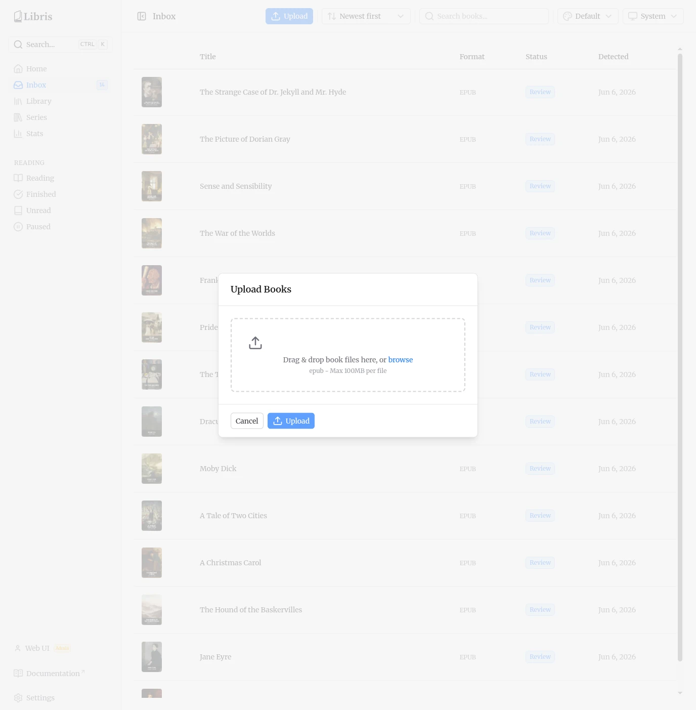
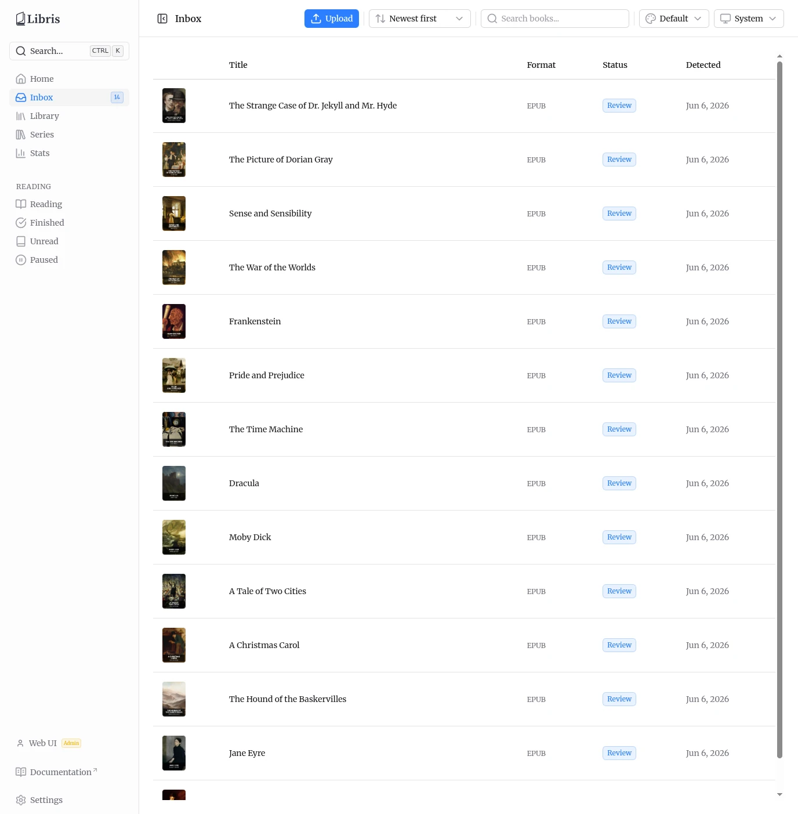
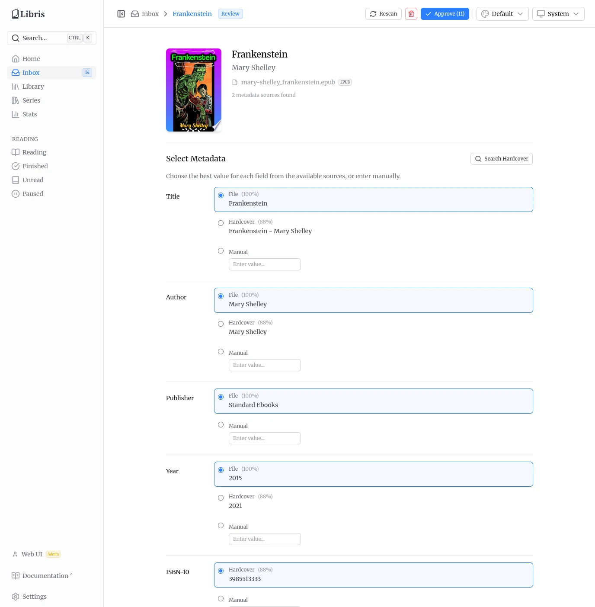
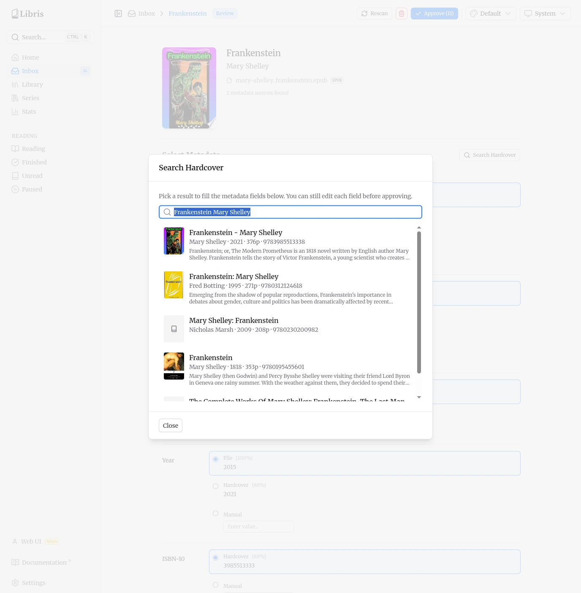

# Adding Books

There are two ways to get books into Libris. Both feed the same ingestion pipeline, which stops at a manual review step before anything reaches the shared library. Only EPUB files are processed; other formats are ignored.

## Two Ways In

### Drop Files into the Inbox Folder

Copy `.epub` files directly into the inbox folder on the server's filesystem. Libris watches this directory with a file watcher (chokidar). The watcher waits for each file to finish writing before acting on it, so partial copies are not picked up mid-transfer. Once a file is complete, the ingestion pipeline starts automatically.

This approach works if you have SSH access to the server or mount the inbox directory over NFS, SMB, or similar. The inbox path is configured by the `LIBRIS_INBOX_PATH` environment variable and shown read-only on the Settings > Paths tab.

### Upload Through the Web UI

From the Inbox page, click the **Upload** button in the top bar. A modal opens with a drag-and-drop zone where you can drop files or click to browse for them.

Only EPUB files are accepted, with a maximum size of 100 MB per file. The upload endpoint writes the file into the inbox directory and records the uploading API key as the file's owner (keyed on the file checksum). It does not start the pipeline itself. The file watcher detects the newly written file and starts processing, exactly as it does for files dropped directly into the inbox folder.

## The Ingestion Pipeline

When a new file is detected, it moves through these stages automatically:

1. **Detected** — The file is checksummed and a database record is created. Duplicate files are caught here, and the uploader is attributed from the upload registry when the file came in through the Upload modal.
2. **Parsed** — Metadata is extracted from the EPUB (Dublin Core), and the content language is predicted and stored as an ISO 639-1 code (for example `en`, `fr`).
3. **Metadata Fetched** — Hardcover is queried if a token is configured. Hardcover is the only external metadata source. Results are stored as metadata candidates.
4. **Review** — The book stops here and waits for you. This is a manual gate: organizing a book into the library is never enqueued automatically. It requires you to approve the book from the review page.

If Hardcover returns nothing (no match, or no token configured), the book is still promoted to **Review** using the candidate derived from the file's own metadata. In that case the review page shows the file-derived values and a manual-entry option, rather than stranding the book in the inbox.

## Inbox List

The inbox list shows every book currently in the inbox or awaiting review, with its cover, title, format, status, and detection date.

You can search the list and sort it. The sort options are:

- **Title A-Z** / **Title Z-A**
- **Newest first** / **Oldest first** (by detection date)
- **Status A-Z** / **Status Z-A**

Books with a **Review** status badge are waiting for you to pick their metadata and approve them.

## Reviewing Metadata

Click any book in the inbox to open its review page. The top of the page shows the book's cover (if one was found), its current title and author, who uploaded it, the attached file, and how many metadata candidates were found.

Below that, the metadata picker lists every field. For each one, you choose a value from up to three sources:

- **File** — Value extracted from the EPUB itself.
- **Hardcover** — Value from the Hardcover API.
- **Manual** — A free-text input where you type the value yourself.

Select the source you want for each field by clicking its radio option. You can mix sources freely — take the title from the file, the author from Hardcover, and type the genres in by hand.

The fields are:

| Field       | Notes                                                                |
| ----------- | -------------------------------------------------------------------- |
| Title       |                                                                      |
| Author      |                                                                      |
| Publisher   |                                                                      |
| Year        | Published year                                                       |
| ISBN-10     |                                                                      |
| ISBN-13     |                                                                      |
| Language    | Stored as an ISO 639-1 code                                          |
| Description |                                                                      |
| Pages       |                                                                      |
| Series      | Selecting a series source also fills the Book # from the same source |
| Book #      | Position within the series                                           |
| Genres      |                                                                      |
| Cover       |                                                                      |

### Search Hardcover

If the automatic Hardcover lookup found the wrong book or nothing at all, use the **Search Hardcover** panel to query Hardcover by free text and pull in a better match. The panel runs against `GET /api/hardcover/search` and adds its results as Hardcover candidates you can then select per field.

If no metadata could be extracted from the EPUB at all, the page shows a "Manual review needed" notice and expects you to enter the details by hand before approving.

## Approve, Rescan, Delete

When your selections are ready, click **Approve** in the top-right corner. The count next to the button shows how many fields will be saved. Approving sets the book's status to organized and queues the organize job, which:

- moves the file into the library at `<library>/<Author>/<Title>/`,
- downloads the cover image to `cover.jpg` in that folder, and
- embeds the approved metadata and cover into the EPUB.

The book then appears in the shared library.

**Rescan** re-queries Hardcover for the book and refreshes its candidates without leaving the review page. **Delete** removes the book and its file from the inbox.

Editing and approving a book in the inbox is restricted to the book's uploader and to admins. Other users can view the review page but cannot change or approve it.
