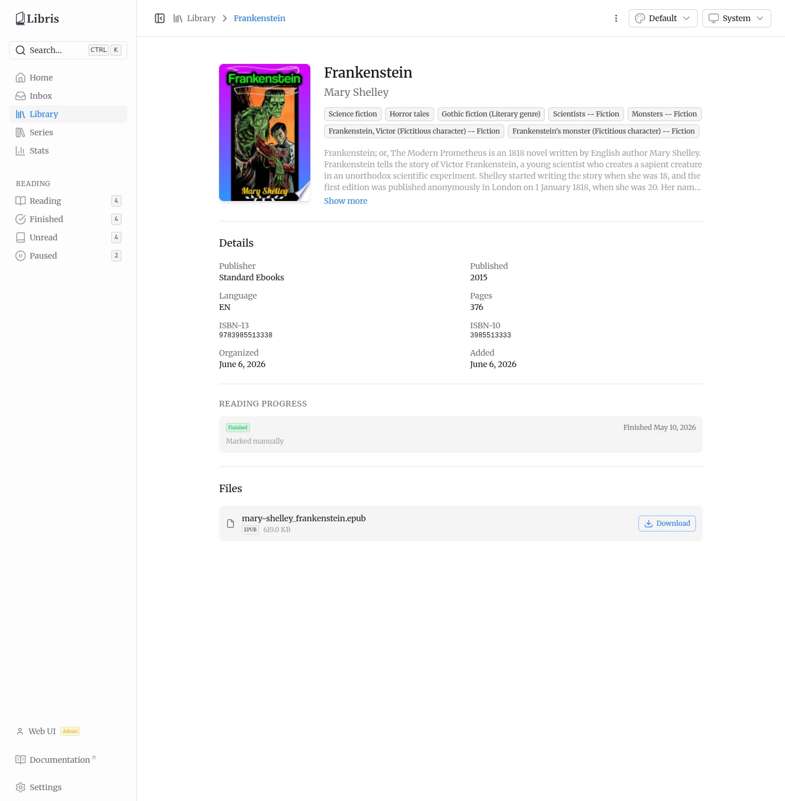
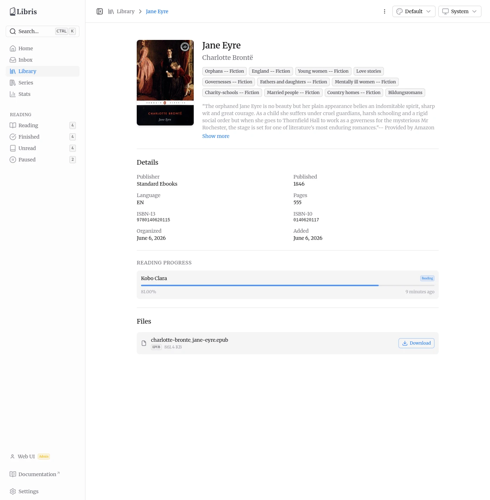
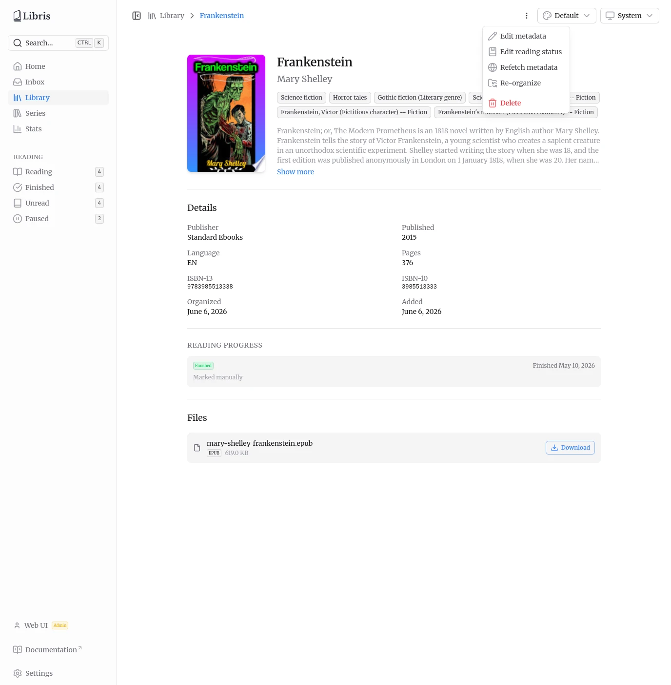
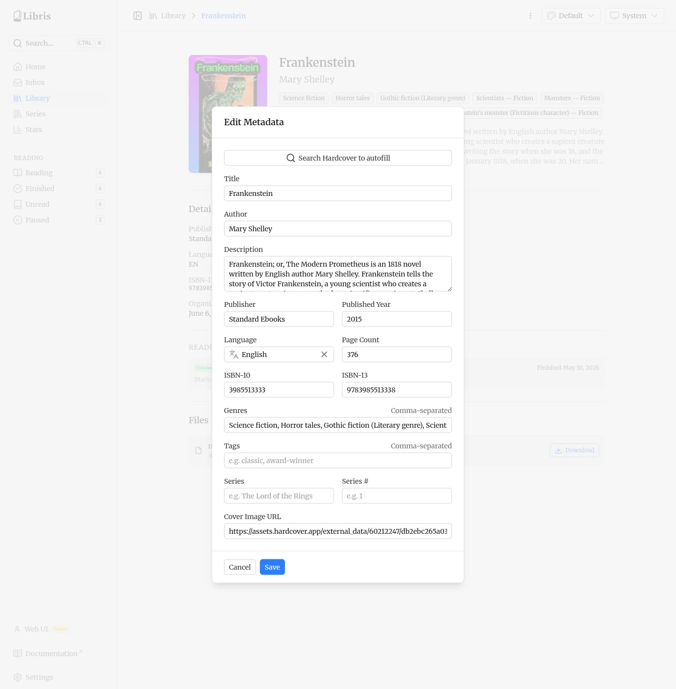
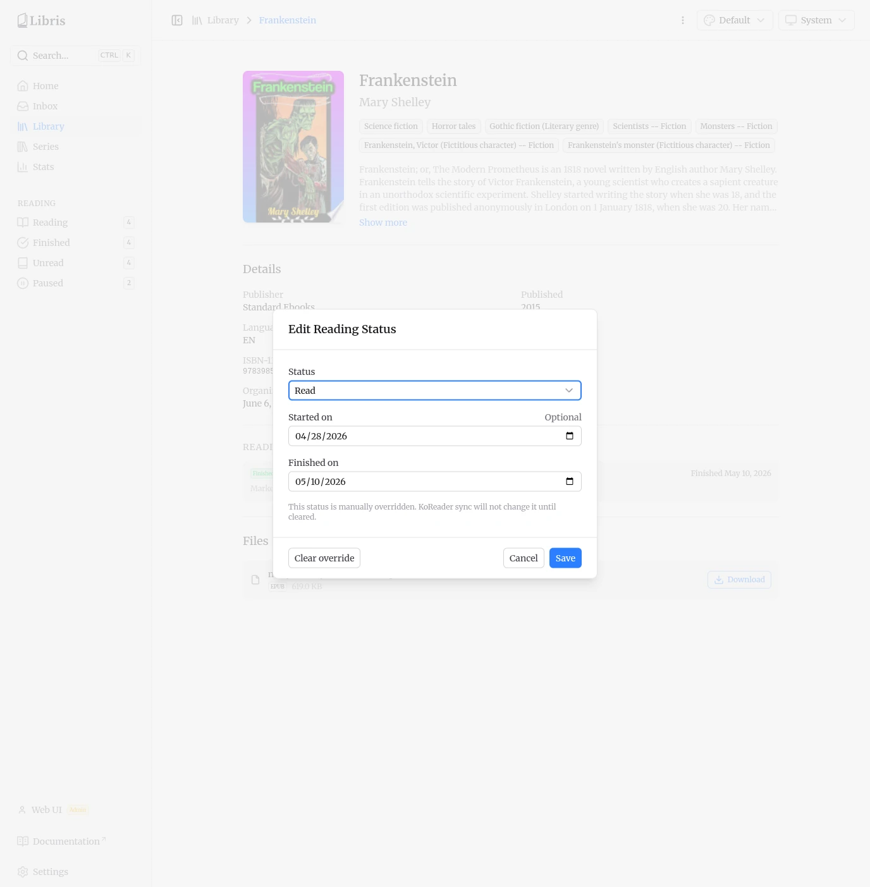
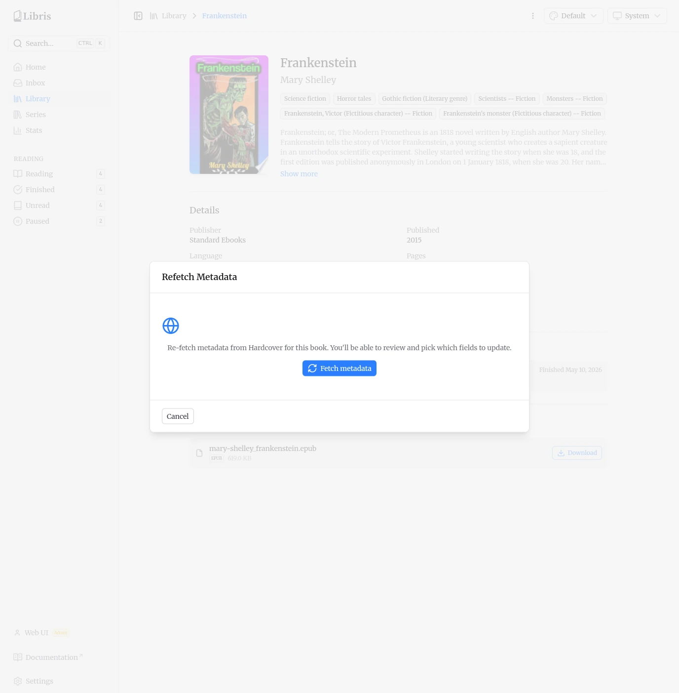
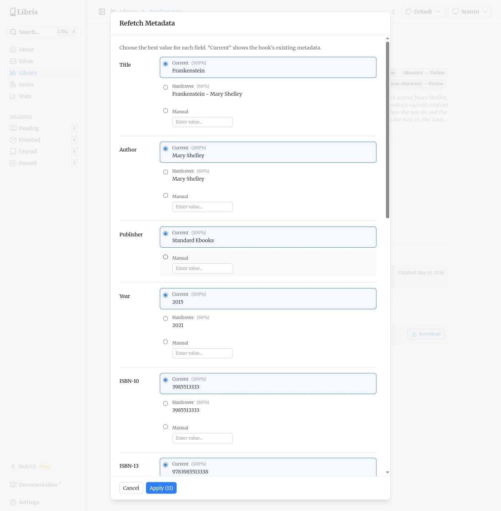

# Book Details

Click any book in the library to open its detail page. This page shows everything Libris knows about a single book, the per-device reading progress, and the files attached to it. For owners and admins it also exposes the actions that edit, refetch, re-organize, or delete the book.

## Page Layout

The detail page is organized top to bottom.

- **Cover image** on the left. A placeholder icon is shown when no cover was downloaded.
- **Title and author** at the top, followed by the series name and number when set. The series name links to the series page.
- **Genre chips** below the title, rendered as badges. Tags, when present, appear as a second row of badges.
- **Uploader attribution** -- "Uploaded by `<name>`", the display name of the account that added the book. The catalog is shared across all users, so this tells you who originally uploaded it — and who, along with any admin, may edit or delete it.
- **Expandable description** -- clamped to four lines with a **Show more** / **Show less** toggle.

### Details Grid

A two-column grid lists the stored metadata. Empty fields are omitted, except **Added**, which is always shown.

| Field     | Source                                    |
| --------- | ----------------------------------------- |
| Publisher | EPUB or chosen metadata                   |
| Published | Published year                            |
| Language  | Canonical ISO 639-1 code, shown uppercase |
| Pages     | Page count                                |
| ISBN-13   | ISBN-13                                   |
| ISBN-10   | ISBN-10                                   |
| Organized | Date the book was approved and organized  |
| Added     | Date the book record was first created    |

### Reading Progress

The Reading Progress section reflects per-user KoReader sync data and any manual override. Reading progress is the one part of this page that is private to your account; the rest of the catalog is shared.

Each KoReader device that has reported progress is listed as its own card: the device name, a status badge, a progress bar, the exact percentage (two decimals, e.g. `81.00%`), and a relative timestamp ("2 days ago"). The per-device status is derived from progress and age:

- **Finished** -- progress is at or above 95%.
- **Reading** -- some progress and the last update is within the past 30 days.
- **Paused** -- some progress but no update for more than 30 days.
- **Unread** -- no progress.

When there are no per-device entries but the book still has a status -- for example a manual override or a status pulled from Hardcover -- a single aggregate card is shown instead. It displays the status badge, a relevant date ("Finished 2026-05-01", "Started ...", or "Paused ..."), and the source line: **Marked manually** for a local override or **Synced from Hardcover** for an external one. Books with no progress at all show "Not started yet".

### Files

The Files section lists each file attached to the book with its original name, format badge, size, and a **Download** button. Downloads stream from `/api/library/{id}/download/{fileId}`.

## Actions Menu

The three-dot menu in the top-right corner opens the actions dropdown. It is shown only to the book owner (the uploader) and to admins. There are **five** actions:

- **Edit metadata** -- open the metadata editor (see below).
- **Edit reading status** -- manually set or clear your reading status (see below).
- **Refetch metadata** -- query Hardcover again and pick which fields to update (see below).
- **Re-organize** -- enqueue a job that moves the book's files to match the current title and author. Useful after editing metadata.
- **Delete** -- permanently remove the book and its files. A confirmation dialog appears first.

## Edit Metadata

Edit metadata opens a modal with every field editable: title, author, description, publisher, published year, language, page count, ISBN-10, ISBN-13, genres and tags (comma-separated), series, series number, and a cover image URL.

The modal also has a **Search Hardcover to autofill** button. It opens an inline Hardcover search panel; picking a result fills the form fields from that Hardcover record so you can review and adjust before saving. Saving updates the detail page immediately. If you changed the title or author, use **Re-organize** from the actions menu to update the folder layout on disk.

## Edit Reading Status

Edit reading status lets you set your status by hand instead of relying on KoReader sync. The status select offers four values: **Unread**, **Reading**, **Read** (stored as `finished`), and **Paused**.

Depending on the status, optional date fields appear:

- **Reading** and **Paused** show a **Started on** date.
- **Read** shows **Started on** and **Finished on**. Finished must be on or after Started.
- **Paused** shows a **Paused on** date.

Dates cannot be in the future. Saving creates a manual override. While an override is active, the modal shows: "This status is manually overridden. KoReader sync will not change it until cleared." A manual override always wins over KoReader-computed and Hardcover-pulled status.

To revert, open the modal again and click **Clear override**. This removes the override and returns the book to its KoReader-computed status. The button appears only when an override is currently set.

## Refetch Metadata

Refetch metadata updates a book that is already in the library, for example to pull a better description or cover. It does not move the book out of the library.

The flow has three visible phases.

**Idle.** The modal opens on a confirmation step describing what will happen. Click **Fetch metadata** to start.

**Fetching.** A loading state is shown while Hardcover is queried. If nothing matches, a "No external metadata found" message offers **Try again**.

**Picker.** Once results return, a per-field picker appears. It works like the inbox review picker, with one difference: the first option for each field is **Current**, the book's existing value, followed by the Hardcover candidates and a manual input. Choose a value for each field you want to change.

The **Apply (N)** button shows how many fields are selected. Applying updates the metadata in place. If the title or author changed, the book is automatically re-organized into the correct `Author/Title/` folder on disk.
