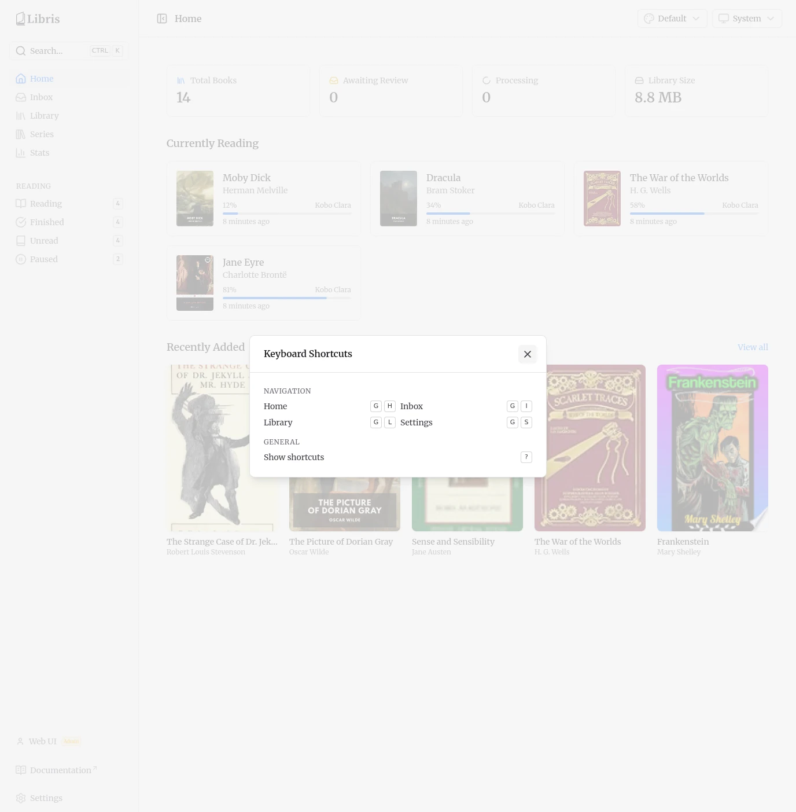

# Dashboard & Shortcuts

The home dashboard is the landing page after login. It summarizes the library, surfaces what you are reading, and flags pipeline activity. Keyboard shortcuts cover navigation and search from any page.

## Dashboard

### Stat cards

Four cards sit at the top of the page:

- **Total Books** -- The number of organized books in the library. The catalog is shared, so this is the count across all users.
- **Awaiting Review** -- The number of inbox books waiting for review. Books you uploaded, not everyone's; admins see the whole install. This card is a link to `/inbox`.
- **Processing** -- Books currently moving through the ingestion pipeline. Your own books only, matching Awaiting Review; admins see the install-wide count. The icon spins while the count is above zero.
- **Library Size** -- Total disk space used by the organized book files. Inbox and review uploads are excluded: they are private to whoever uploaded them, so their size is not published to everyone.

### Currently Reading

The Currently Reading grid lists books with active reading progress. Each card shows the cover, title, author, a progress bar with the current percentage, the device that last reported progress, and a relative timestamp of the last read. Click any card to open the book detail page at `/library/{id}`.

The section is hidden when there are no books with reading progress.

### Recently Added

The Recently Added grid shows the most recently organized books as cover cards. The **View all** link in the section header goes to `/library`. Click any cover to open its detail page.

The section is hidden when no books have been added.

### Pipeline Status

The Pipeline Status section is **admin-only**, and appears only when there is pipeline or failed-job activity -- that is, when any ingestion queue has active, waiting, delayed, or failed jobs. It is hidden when the pipeline is idle, and always hidden for non-admins: queue counts describe the whole install, including work on books another person uploaded and has not yet approved.

A summary row shows counts for **Active**, **Waiting**, **Delayed**, and **Failed** jobs. Below it, a per-queue breakdown lists each queue (Detection, Parsing, Metadata, Organize) that has active or failed jobs.

When there are failed jobs, a **View failed jobs** link appears and deep-links to `/settings?tab=failed-jobs`, where you can inspect error details and retry individual jobs. See the [Settings page](./settings.md) for more on the Failed Jobs tab.

## Keyboard Shortcuts

Press `?` on any page to open the keyboard shortcuts reference.

### Navigation

| Shortcut     | Action         |
| ------------ | -------------- |
| `G` then `H` | Go to Home     |
| `G` then `I` | Go to Inbox    |
| `G` then `L` | Go to Library  |
| `G` then `S` | Go to Settings |

Press `G`, release it, then press the second key.

### General

| Shortcut | Action                               |
| -------- | ------------------------------------ |
| `Ctrl+K` | Open global search / command palette |
| `?`      | Show the keyboard shortcuts modal    |

`Ctrl+K` opens the same search dialog as the **Search** button in the sidebar. It jumps to pages and searches the library.
