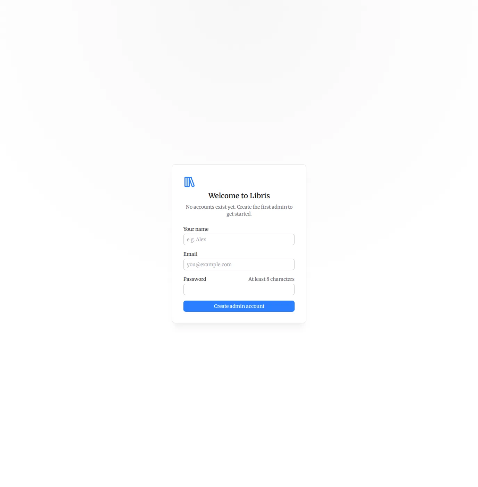
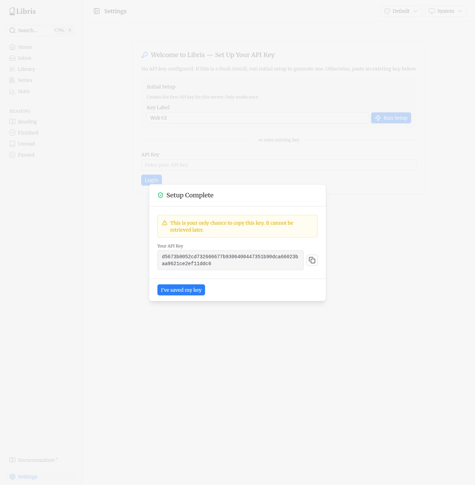

# Getting Started

This page covers the first-run setup, how users and roles work, and which data is shared between users versus kept per user. Read it before adding any books.

## First-Run Setup

When you start Libris for the first time there are no API keys yet. While you are logged out, `/settings` is the only route you can reach. Any other path redirects there. The Settings page doubles as both the setup screen and the login screen.

Enter a label for the first key (for example `Web UI`) and click **Run Setup**. This calls `POST /api/auth/setup`, which creates the first API key. The first key is always created as an admin. Setup only works while no keys exist; once a key is present, it returns 409.

The new key is shown once, in a **Setup Complete** dialog.

::: warning
The dialog states "This is your only chance to copy this key. It cannot be retrieved later." Copy the key and store it somewhere safe before you dismiss the dialog. The server only stores a bcrypt hash of the key, so there is no way to recover the raw value afterward. If you lose it, delete the key and create a new one.
:::

Setup does not log you in. After you copy the key and dismiss the dialog, paste it into the **Login** form on the same page and click **Login**. This calls `POST /api/auth/login`, which validates the key and sets the session cookie.

::: tip
The session cookie (`books-auth`) is httpOnly and holds your API key encrypted with an Iron seal, server-side. The browser never reads the raw key, and the key is not exchanged for a separate authorization token. The cookie is set with `SameSite=Lax`, `Secure` in production, and a 30-day max age.
:::

## Users and Roles

There is no separate users table. The `api_keys` table is the identity table. Each API key is a user, and the `is_admin` flag on the key marks admins. The key created during setup is an admin; keys created afterward are regular users unless you create them as part of a separate admin key.

### Admin vs regular users

- **Admin** users see all Settings tabs (Connections, API Keys, System, Jobs, Failed Jobs, Queues, Paths), can create and revoke API keys, view server health, and manage job queues.
- **Regular** users see only the **Connections** tab. They can set up their own OPDS, KoSync, and Hardcover credentials, track their own reading progress, and upload books.

Admins can see and manage every key. A regular user only sees their own key in the API Keys list.

### Creating additional users

Admins create new users from **Settings > API Keys**. Enter a label (for example the person's name) in **New Key Label** and click **Create Key** (`POST /api/auth/keys`).

New keys created this way are regular (non-admin) users, so they carry no **Admin** badge in the key list. The raw key is shown once, with the note "Copy this key now. It cannot be retrieved later." Share it with the new user. They log in by pasting it into the Login form on the Settings page, the same way you did during setup.

The list cannot drop below one key, and the last admin key cannot be deleted, so you can never lock yourself out of admin access.

## Shared vs Per-User Data

This is the most important thing to understand in a multi-user install:

**The organized book library is shared across all users.** Every user sees every organized book in the library, the OPDS catalog, and the series view, regardless of who uploaded it. Books show an uploader badge, and the Library has an optional **Uploaded by** filter so you can narrow to a specific uploader, but that is a filter, not a boundary. There is no per-user library.

Only the following data is per user, scoped to the API key:

- **Reading progress** synced from KoReader.
- **Reading-status overrides** set manually on a book.
- **Service credentials** for OPDS, KoSync, and Hardcover.
- **Upload ownership** (which key uploaded a given file).
- **Reading stats** on the Stats page.

So if two people use the same Libris instance, they share one library but keep separate reading progress, separate stats, and their own external-service connections.
