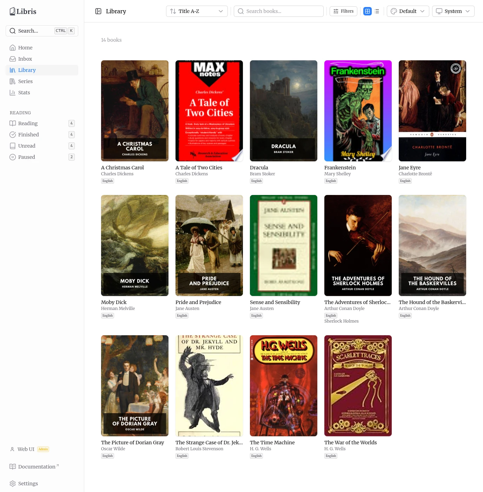

# User Guide

Libris is a self-hosted book management system. It ingests EPUB files, enriches their metadata from [Hardcover](https://hardcover.app) (the sole external metadata source), organizes them into a structured `Author/Title/` library, serves them to e-readers through a built-in OPDS catalog, and syncs reading progress with KoReader over KoSync. Everything runs on your own hardware. The only external account is an optional, per-user Hardcover API token used for metadata enrichment and reading-status sync.

A few facts shape how the rest of this guide reads:

- **Hardcover is the only external metadata source.** When a Hardcover lookup returns nothing, the book is still promoted to review using the metadata extracted from the file, so you can complete it manually.
- **The organized library is shared.** Every authenticated user sees every organized book, with uploader attribution and an optional "Uploaded by" filter. Reading progress, reading-status overrides, per-account connections, upload ownership, and reading stats are the only per-user data.
- **Accounts are created by an admin.** There is no self-registration and no password-reset email. The first admin is created by a first-run form; everybody after that is added from Settings.
- **Devices use app passwords.** Your account password stays in the browser. E-readers, scripts and the OPDS catalog get their own per-device credential that you can revoke on its own.
- **Only EPUB files are ingested.** Other formats dropped into the inbox are ignored.

## In this guide

- [Getting Started & Users](./getting-started) -- First-run setup, sign-in, accounts and roles, and pairing a device with an app password.
- [Settings & Connections](./settings) -- Settings tabs, your account, user management, app passwords, OPDS / KoSync / Hardcover connections, and paths.
- [Adding Books & Inbox Review](./adding-books) -- Inbox folder, upload, the ingestion pipeline, and metadata review.
- [Library & Series](./library) -- Grid and list views, filters, search, and series browsing.
- [Book Details & Editing](./book-details) -- The detail page, edit metadata, edit reading status, and refetch.
- [Reading Progress, Stats & Hardcover Sync](./reading-and-stats) -- Reading-status derivation, reading shelves, stats, and Hardcover sync.
- [OPDS Catalog](./opds) -- The OPDS feeds, supported readers, and connecting a reader.
- [Dashboard & Keyboard Shortcuts](./dashboard-shortcuts) -- The home dashboard and keyboard navigation.
