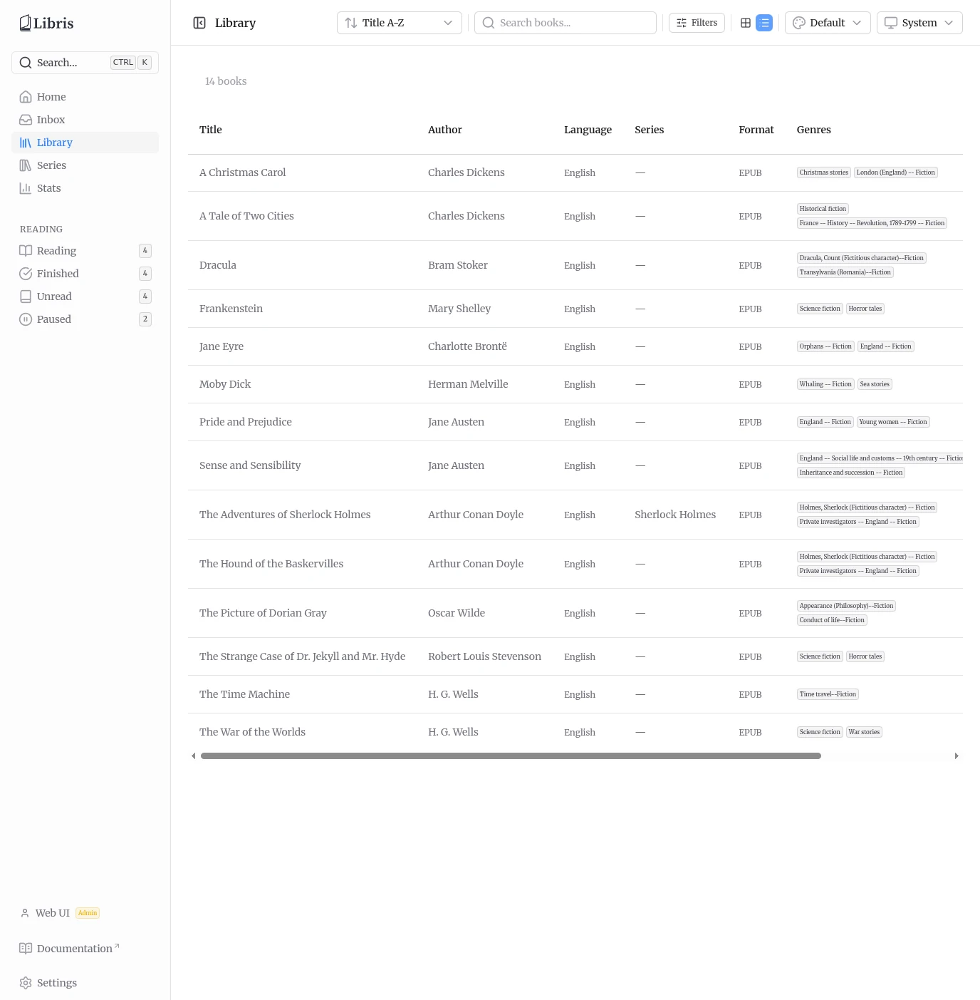
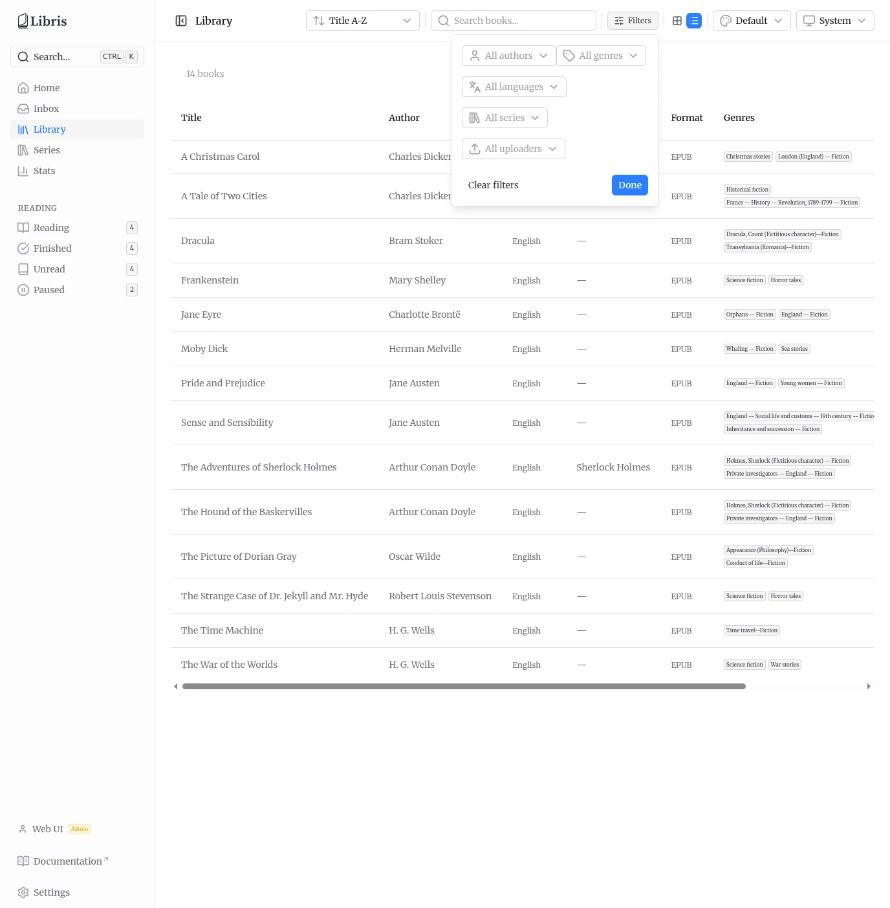
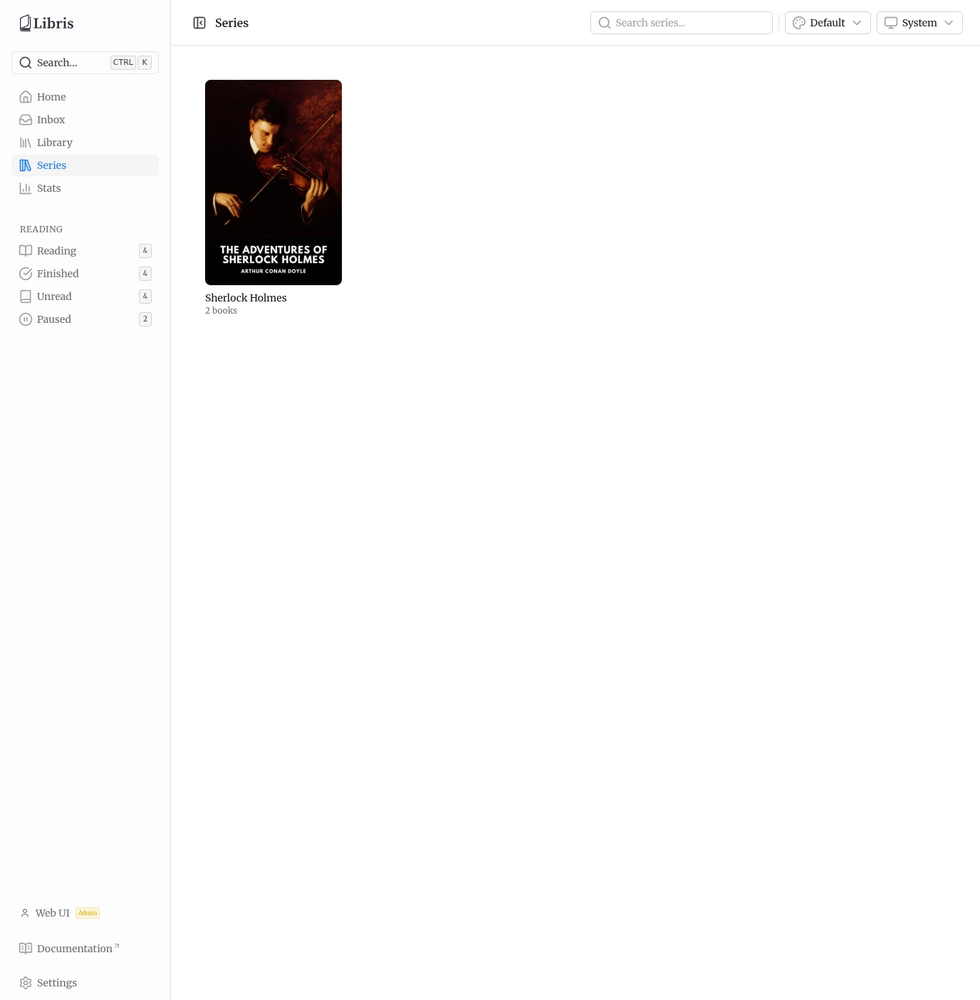
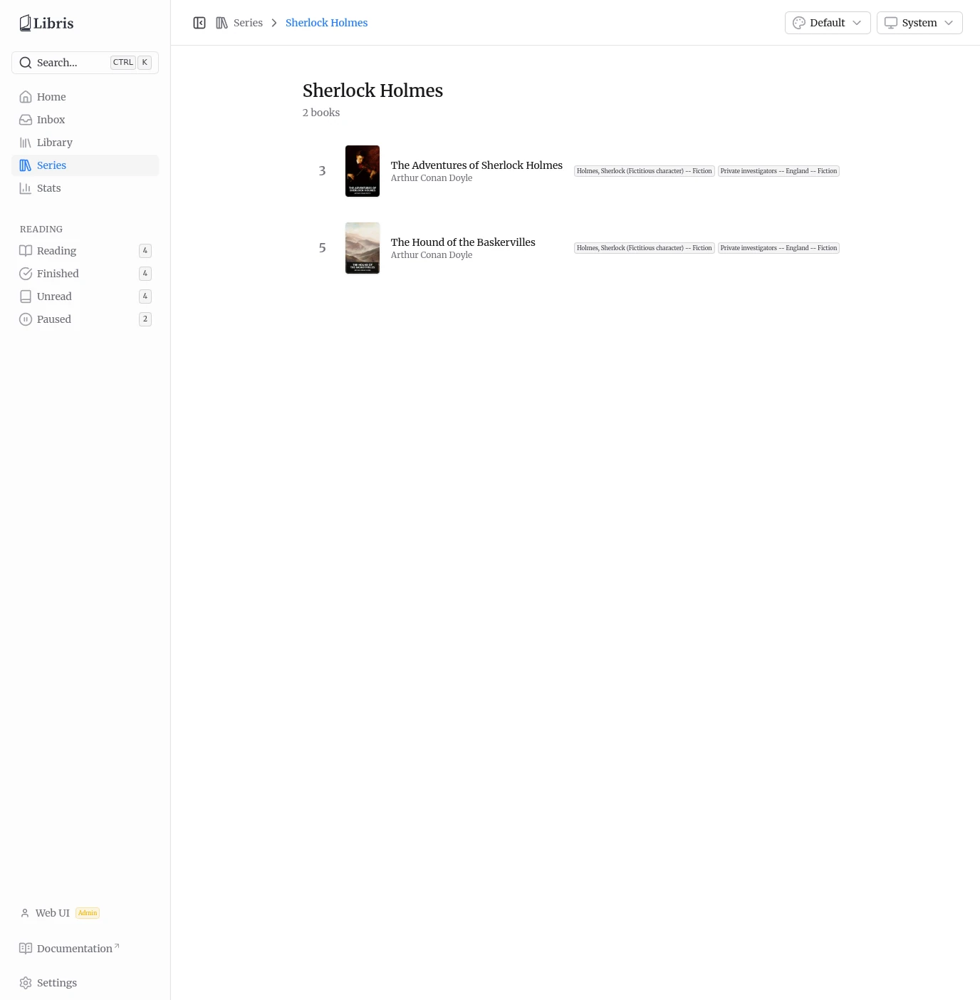

# Library

Once a book is approved in the inbox, it moves to `organized` status and appears in the library. The library is the shared catalog: every signed-in user sees every organized book, regardless of who uploaded it. Each book carries an uploader attribution so you can tell who added it, and there is a filter to narrow by uploader. Only reading progress, manual status overrides, per-account connections, and stats are per user.

The library page offers two views and several ways to find what you are looking for.

## Grid View

The default grid view displays book covers with the title and author underneath. Compact badges show the language and the uploader label when that metadata is present. If a book belongs to a series, the series name and position (for example `Foundation #2`) appear under the author.

## List View

Toggle to list view for a table. The columns are:

- **Title**
- **Author**
- **Language** (rendered as a full name from the stored ISO 639-1 code)
- **Series** (name plus `#` position when set)
- **Format** (for example `EPUB`)
- **Genres** (first two shown as badges)
- **Uploaded by** (the display name of the account that added it)
- **Added** (the date the book was organized)

The view choice is remembered in your browser between visits.

## Filtering and Search

The toolbar at the top of the library keeps sort, search, and the view toggle visible. Faceted filtering lives in a **Filters** popover, opened from the toolbar. A badge on the button shows how many filters are active.

The Filters popover offers five facets, each a searchable select populated from the books actually in the library:

- **Author** -- narrow to a specific author.
- **Genre** -- narrow to a specific genre.
- **Language** -- narrow by language. Options are shown as full names; the value sent is the ISO 639-1 code (for example `en`, `fr`).
- **Series** -- narrow to a single series.
- **Uploaded by** -- narrow to the books added by a specific account. Admins see everyone in this list; a regular user sees only themselves.

Use **Clear filters** inside the popover to reset all facets, or **Done** to close it.

Outside the popover, the toolbar provides:

- **Sort** -- Title A-Z, Title Z-A, Author A-Z, Author Z-A, Newest first, Oldest first, and Series order. The chosen sort is remembered in your browser.
- **Search** -- full-text search across titles, authors, and other metadata. The search is typo-tolerant (trigram-backed), so close matches still surface results.

Any active filters appear as removable chips above the results, alongside the total book count. Click a chip to drop that one filter, or **Clear all** to remove every filter at once.

There is also a global command palette available from anywhere in the app via `Ctrl+K` (or the **Search** button in the sidebar). It searches across both the library and navigation links.

## Series

Series is a first-class, top-level feature with its own sidebar entry between **Library** and **Stats**. A book joins a series when its `series` metadata field is set (from the inbox review picker, an edit, or Hardcover). Series membership is derived from that field; there is nothing extra to configure.

### Series List

The `/series` page is a grid of every series in the shared catalog. Each card shows a representative cover, the series name, and the book count (for example `4 books`). The representative cover is the first book in the series by position, falling back to the embedded cover of an unmatched book so series with no Hardcover match still render artwork.

A search box in the toolbar filters series by name (partial match). Click a card to open the series detail page.

### Series Detail

The `/series/:name` page lists every book in that series, ordered by series position (`series_index`, with unpositioned books last). Each row shows the position number, the cover, the title and author, and up to two genre badges. Click a row to open that book's detail page. Press `Escape` to return to the series list.

Series are also exposed in the OPDS catalog under the **Series** navigation feed. See [OPDS Catalog](./opds.md) for details.
