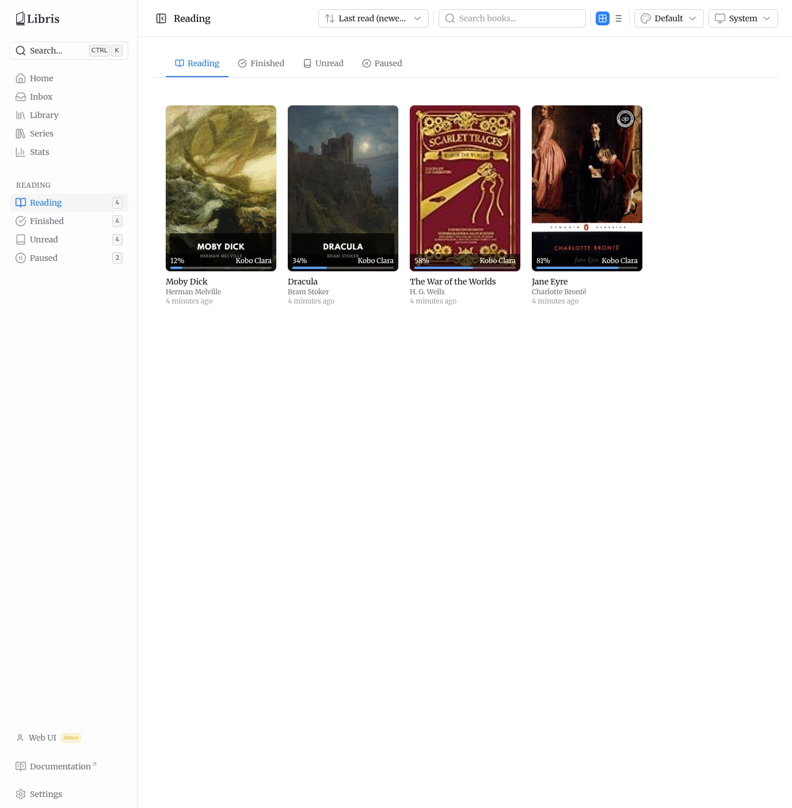
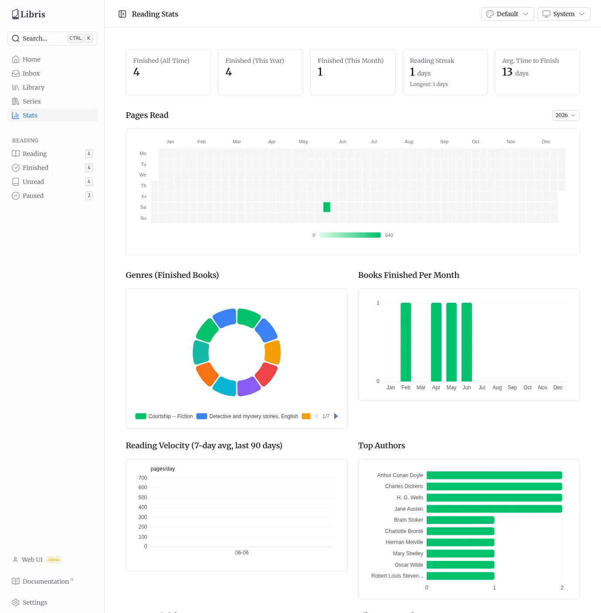

# Reading Progress, Stats & Hardcover Sync

Libris tracks reading progress through KoReader's KoSync protocol. Read on your KoReader device and progress syncs into Libris in the background. From that progress data, Libris derives a reading status for each book, exposes per-status reading shelves, and computes a set of reading statistics. If you connect a Hardcover account, status is also synced to and from Hardcover.

## How Reading Status Is Derived

Each book has a computed reading status based on its highest recorded progress and the time of its last progress update:

- **Unread** — No progress recorded (0%, or no progress at all).
- **Reading** — Progress above 0% but below 95%, with a progress update within the last 30 days.
- **Finished** — Progress reached **95% or higher**. The threshold is 95% (`FINISHED_THRESHOLD = 0.95`), not 100%, because many EPUBs include trailing back matter that a reader never reaches.
- **Paused** — A book with progress (above 0%, below 95%) that has had no progress update for more than **30 days** (`PAUSED_DAYS = 30`). A book with progress but no recorded last-activity timestamp is also treated as paused.

You can override the computed status manually from the book detail page (Actions menu, **Edit reading status**). A manual override always wins over the computed status; KoReader sync will not change it until you clear the override. Clearing the override reverts the book to its computed status. See [Book Details](./book-details.md) for the Edit reading status modal.

## Reading Shelves

The sidebar has a **Reading** group with four links — **Reading**, **Finished**, **Unread**, and **Paused** — each showing a live count badge of how many books are in that state.

Each link opens the reading shelf at `/reading/<status>`. The shelf page provides:

- **Status tabs** across the top to switch between Reading, Finished, Unread, and Paused without leaving the page.
- A **grid / list** view toggle.
- A **search** box that filters the current shelf by title and author.
- **Sort** options: Last read (newest), Last read (oldest), Progress (high), Progress (low), Title A-Z, and Title Z-A.

Each book card shows its cover, progress percentage, the device it was last read on, and how recently it was updated. Clicking a card opens that book's detail page.

## Stats Page

The **Stats** page (sidebar entry **Stats**) reports reading analytics computed from your own progress data. Reading stats are per-user.

### Summary Cards

Five summary cards run across the top:

- **Finished (All Time)** — Total books finished.
- **Finished (This Year)** — Books finished in the current calendar year.
- **Finished (This Month)** — Books finished in the current calendar month.
- **Reading Streak** — Your current streak in days, with your longest streak shown below it.
- **Avg. Time to Finish** — Average number of days between starting and finishing a book.

### Pages Read Heatmap

Below the summary cards is a full-width **Pages Read** heatmap covering a full calendar year, with a **year picker** so you can switch between years. The picker offers the last five calendar years plus any earlier year that has heatmap data.

### Charts

Below the heatmap is a grid of six charts:

- **Genres (Finished Books)** — A donut chart of the genres of books you have finished.
- **Books Finished Per Month** — Finished-book counts by month.
- **Reading Velocity (7-day avg, last 90 days)** — A 7-day rolling average of reading activity over the last 90 days.
- **Top Authors** — The authors you have read the most.
- **Days to Finish** — A histogram of how long books took to finish.
- **Library Growth** — How your library size has grown over time.

## Hardcover Sync

If you connect a Hardcover account in **Settings > Connections** (see [Settings](./settings.md)) and enable **Sync reading progress**, Libris syncs reading status with Hardcover. Sync runs automatically once per day at **04:00**, and you can trigger it on demand with **Sync Now** in the Hardcover section of the Connections tab. Use **Show Sync Log** there to inspect what was synced.

Status sync works in both directions:

- **Libris to Hardcover (push)** — Libris computes each book's effective status (manual override if set, otherwise the computed status) and pushes it to Hardcover. Libris never pushes an `unread` status: a book with no local reading data and no manual override is skipped, so Libris does not overwrite a status you already set on Hardcover.
- **Hardcover to Libris (pull)** — When you connect a Hardcover account, Libris pulls your existing Hardcover statuses for matched books and stores them as a read-only fallback. These pulled statuses surface for books that have no local reading data, so a fresh install with an existing Hardcover library shows reading state across the library without re-marking anything. Pulled statuses never feed the push path back to Hardcover.

Hardcover's **Did Not Finish** maps to the Libris **paused** status, since Libris does not model abandonment separately.

A manual local override always wins. If you set a status on a book in Libris from the detail page, that status is what Libris pushes and what it shows locally, regardless of what Hardcover reports, until you clear the override.
