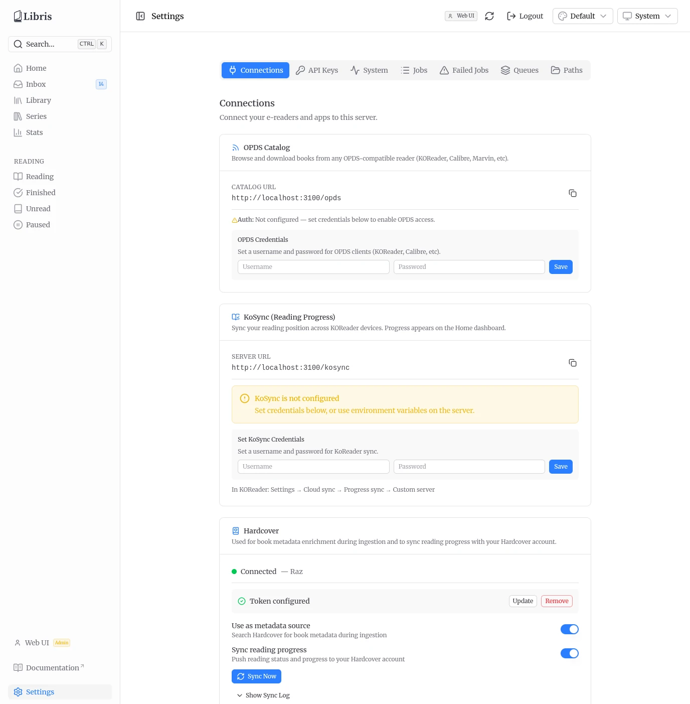
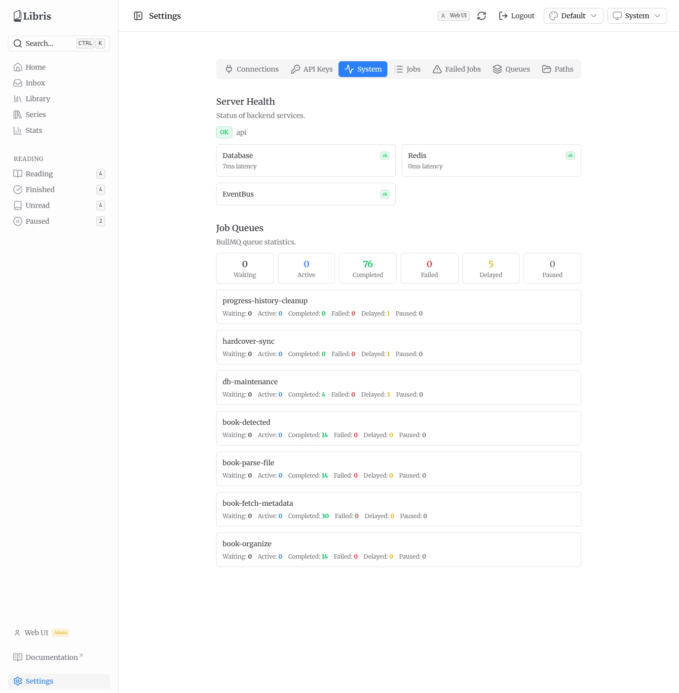
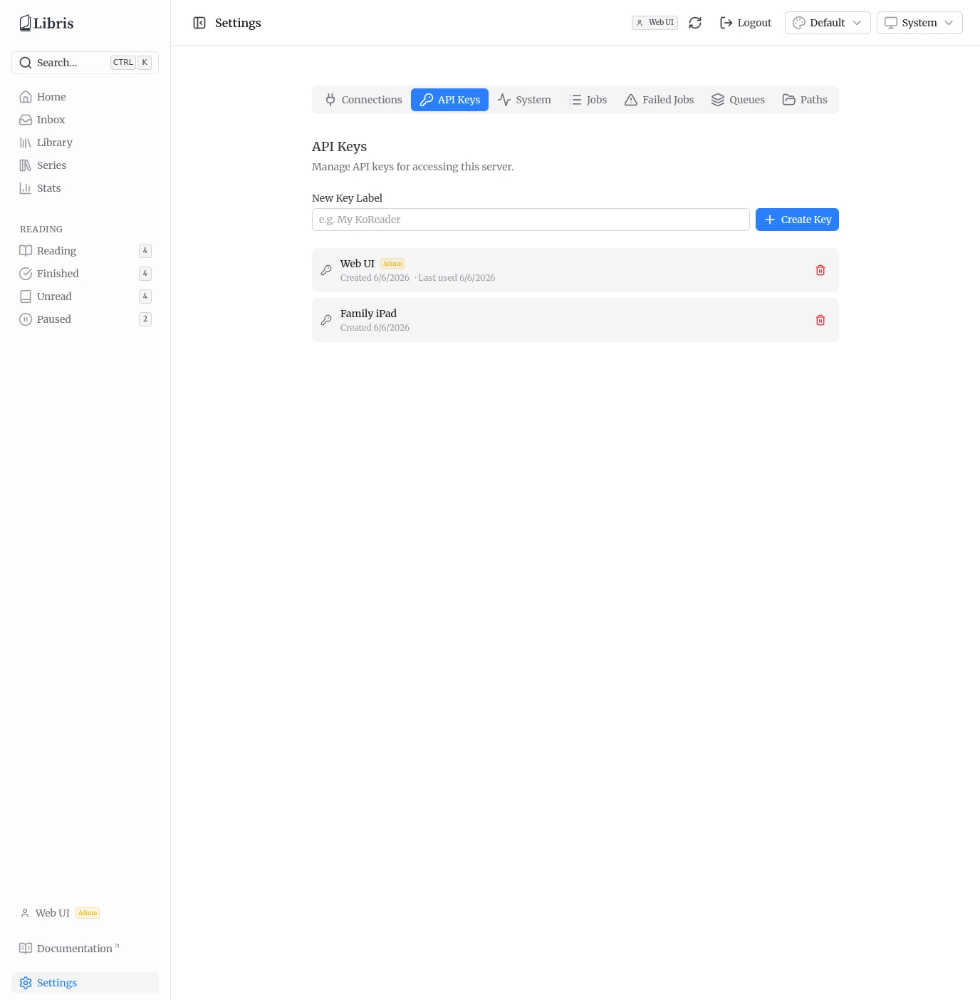
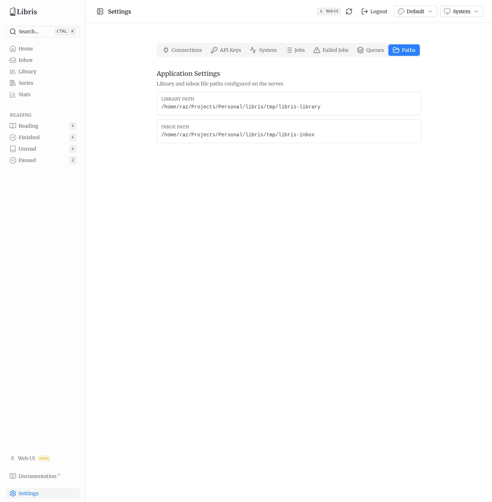

# Settings

The Settings page is where you connect external services, check server health, and view the configured file paths. It is also the page that handles initial setup and login (see [Getting Started](./getting-started.md)).

## Tabs

What you see depends on whether your API key is an admin key.

- **Admin** keys see seven tabs: **Connections**, **API Keys**, **System**, **Jobs**, **Failed Jobs**, **Queues**, and **Paths**.
- **Regular** (non-admin) keys see only the **Connections** tab.

This page covers Connections, System, and Paths. API key management is described in [Getting Started](./getting-started.md), and the Jobs / Failed Jobs / Queues tabs are operational tools for inspecting and retrying BullMQ jobs.

## Connections

The Connections tab is where you wire up the services that e-readers and apps use to reach this server. It has three sections: OPDS Catalog, KoSync, and Hardcover.

### OPDS Catalog

OPDS is how e-readers browse and download books from the library. The catalog URL is shown here as `<host>/opds`, with a copy button.

OPDS uses HTTP Basic authentication. Set a username and password in the **OPDS Credentials** form. The password is stored as a bcrypt hash. Point your reader (KOReader, Calibre, Marvin, and others) at the catalog URL and enter these credentials.

OPDS credentials are per-user, but the catalog itself is shared: every authenticated OPDS user sees the entire organized library regardless of who uploaded each book. See [OPDS Catalog](./opds.md) for details on the browse feeds and supported readers.

### KoSync (Reading Progress)

KoSync syncs your reading position from KOReader devices back into Libris. The server URL is shown here as `<host>/kosync`, with a copy button.

Set a username and password in the **Set KoSync Credentials** form. This is the only place KoSync credentials can be set — there is no `KOSYNC_*` environment variable, and there never was. Once saved, the tab shows the configured username.

To connect a device, in KOReader go to **Settings -> Cloud sync -> Progress sync -> Custom server** and enter the URL shown on this tab.

Use **Login**, not **Register**. Libris accounts are created by an admin, so
KOReader's registration button is refused by the server — it will report that
registration is disabled and tell you to set your credentials here. Create them
in the form above first, then log in on the device with the same username and
password.

### Hardcover

Hardcover is the external metadata source used during ingestion, and the service that reading progress is synced to. It is connected per-user with an API token.

Get your token at [hardcover.app/account/api](https://hardcover.app/account/api) and paste it into the **Hardcover API Token** field, then click **Save**. The token is set here, not via an environment variable. It is stored with reversible encryption (sealed), so it can be read back to call the Hardcover API.

::: tip
Each user connects their own Hardcover account. Your token is scoped to your API key and is not visible to other users.
:::

Once a token is configured, the section shows a connection status indicator (Connected / Not connected, with the Hardcover username) and the last sync time, plus these controls:

- **Use as metadata source** -- toggle whether Hardcover is queried for book metadata during ingestion.
- **Sync reading progress** -- toggle whether reading status and progress are pushed to your Hardcover account.
- **Sync Now** -- enqueue a Hardcover sync job immediately. Disabled when both toggles are off.
- **Show Sync Log** -- expand a table of recent sync entries (book, status, progress, synced-at time).

To change the token later, use **Update**; to disconnect, use **Remove**. For how reading status is derived and synced, see [Reading and Stats](./reading-and-stats.md).

## System (admin only)

The System tab is a health and queue dashboard.

**Server Health** shows an overall API status badge plus a card per backend check (for example Database, Redis, and the event bus), each with its status and latency in milliseconds.

**Job Queues** shows BullMQ statistics: a summary row totalling jobs across all queues by state (Waiting, Active, Completed, Failed, Delayed, Paused), followed by a per-queue breakdown of the same counts.

This is the first place to look if ingestion seems stuck. If a queue shows failed jobs, switch to the **Failed Jobs** tab to see error details and retry individual jobs.

## API Keys (admin only)

The API Keys tab lists every key on the server with its label, creation date, and admin status, and lets admins create new keys or revoke existing ones. Creating keys is covered in [Getting Started](./getting-started.md).

## Paths (admin only)

The Paths tab shows the **Library Path** and **Inbox Path** configured on the server. These are set via environment variables at deployment time and are read-only here.

- The **inbox path** is where new book files land before processing.
- The **library path** is where organized books are stored in an `Author/Title/` folder structure.

See [Adding Books](./adding-books.md) for how files move from the inbox into the library.
